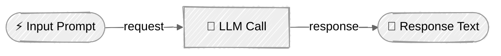

<!-- ---
title: "Simple LLM Call"
description: "Make your first API call using Anthropic Claude, OpenAI GPT, and LiteLLM"
icon: "zap"
--- -->

# Simple LLM Call

Learn how to make basic calls to LLM APIs. This tutorial demonstrates how to interact with different LLM providers and get a simple text response.

> **📚 Setup & Running:** See [SETUP.md](../../SETUP.md) for prerequisites, setup instructions, and how to run tutorials.

## 🎯 What You'll Learn

- Initialize and configure LLM clients for different providers
- Make simple API calls with single prompts
- Extract text responses from API calls
- Use a unified interface (LiteLLM) to work with multiple providers

## 📦 Available Examples

| Provider                                                                                                       | File                                                 | Description                        |
| -------------------------------------------------------------------------------------------------------------- | ---------------------------------------------------- | ---------------------------------- |
|  | [01_llm_call_anthropic.py](01_llm_call_anthropic.py) | Basic Claude Messages API calls    |
|           | [02_llm_call_openai.py](02_llm_call_openai.py)       | Basic OpenAI Responses API calls   |
|                                     | [03_llm_call_litellm.py](03_llm_call_litellm.py)     | Unified interface for any provider |

## 🔑 Key Concepts

### 1. Simple LLM Call Flow



### 2. LLM Client Initialization

Each provider has its own client initialization:

**Anthropic:**
```python
import anthropic

client = anthropic.Anthropic()  # Uses ANTHROPIC_API_KEY from env
model = "claude-sonnet-4-5-20250929"
```

**OpenAI:**
```python
from openai import OpenAI

client = OpenAI()  # Uses OPENAI_API_KEY from env
model = "gpt-4.1"
```

**LiteLLM:**
```python
from litellm import completion

# No client needed - just call completion()
# Uses appropriate API key based on model name
```

### 3. Making API Calls

**Anthropic (Messages API):**
```python
response = client.messages.create(
    model="claude-sonnet-4-5-20250929",
    temperature=0.1,
    max_tokens=1024,
    system="You are a helpful AI assistant.",
    messages=[
        {"role": "user", "content": "Hello!"}
    ],
)
text = response.content[0].text
```

**OpenAI (Responses API):**
```python
response = client.responses.create(
    model="gpt-4.1",
    temperature=0.1,
    max_output_tokens=1024,
    instructions="You are a helpful AI assistant.",
    input="Hello!",
)
text = response.output_text
```

**LiteLLM (Unified API):**
```python
response = completion(
    model="gpt-4.1",  # Or "claude-sonnet-4-5-20250929"
    temperature=0.1,
    max_tokens=1024,
    messages=[
        {"role": "system", "content": "You are a helpful AI assistant."},
        {"role": "user", "content": "Hello!"}
    ],
)
text = response.choices[0].message.content
```

> These examples show basic (non-streaming) API calls. For streaming responses, see the [Anthropic Streaming docs](https://docs.anthropic.com/en/api/messages-streaming), [OpenAI Streaming docs](https://platform.openai.com/docs/api-reference/streaming), and [LiteLLM Streaming docs](https://docs.litellm.ai/docs/completion/stream).

### 4. Key Configuration Parameters

**Model**: Specifies which LLM to use (e.g., `claude-sonnet-4-5-20250929`, `gpt-4.1`)

**Temperature**: Controls randomness (0.0 = deterministic, 1.0 = creative)
- Lower values (0.0-0.3) for factual, consistent responses
- Higher values (0.7-1.0) for creative, varied outputs

**Max Tokens**: Limits the response length
- Anthropic/LiteLLM: `max_tokens`
- OpenAI Responses API: `max_output_tokens`

**System Prompt**: Defines the assistant's behavior and context
- Anthropic: `system` parameter
- OpenAI: `instructions` parameter
- LiteLLM: System message in `messages` array

> Other advanced parameters like `top_p`, `top_k`, `stop_sequences`, `presence_penalty`, `frequency_penalty`, and `seed` will be covered in future tutorials.

## 🏗️ Code Structure

All examples follow a consistent structure:

```python
class LLMClient:
    """Encapsulates LLM interaction logic."""

    def __init__(self, model: str):
        self.client = ...  # Initialize API client
        self.model = model
        self.system_prompt = "..."

    def run(self, prompt: str) -> str:
        """Execute a single LLM call."""
        # 1. Make API call
        response = self.client...

        # 2. Extract and return text
        return response_text


def main() -> None:
    """Orchestrates execution flow."""
    # 1. Initialize client
    client = LLMClient("model-name")

    # 2. Define prompt
    prompt = "..."

    # 3. Get response
    response = client.run(prompt)

    # 4. Display result
    logger.info(f"Response: {response}")
```

## 👉 Next Steps

Once you've mastered simple LLM calls, continue to:
- **[Prompt Engineering](../02-prompt-engineering/README.md)** - Learn to craft effective prompts for better responses
- **Experiment** - Try different models, temperatures, and prompts
- **Explore** - Modify the examples to add features like retry logic or error handling
