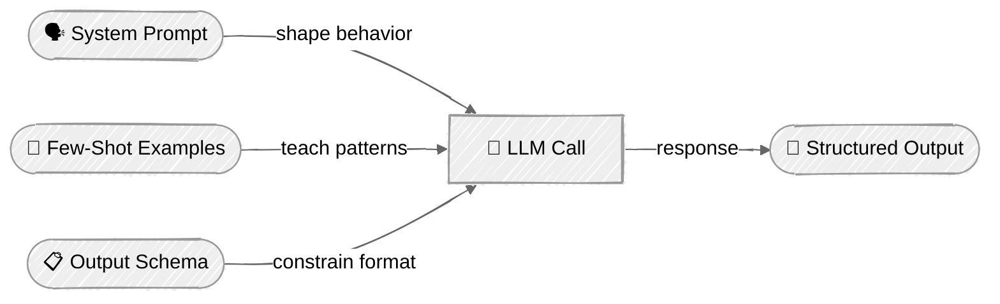

<!-- ---
title: "Prompt Engineering"
description: "Learn prompt engineering techniques including system messages, few-shot examples, and structured output"
icon: "wand"
status: "coming-soon"
--- -->

# Prompt Engineering

Learn how to shape LLM behavior through prompting techniques. Every AI agent's capabilities start with how its prompts are engineered — this tutorial covers the core techniques you'll use in every agent you build.

> **📚 Setup & Running:** See [SETUP.md](../../SETUP.md) for prerequisites, setup instructions, and how to run tutorials.

## 🎯 What You'll Learn

- Use system prompts and role engineering to control LLM behavior
- Apply few-shot prompting for in-context learning
- Guide reasoning with chain-of-thought (CoT) prompting
- Extract structured JSON output via prompt instructions
- Use provider-specific techniques: Anthropic XML scaffolding + prefill, OpenAI JSON schema enforcement
- Compare prompting strategies side-by-side to understand their trade-offs

## 📦 Available Examples

| Provider                                                                                                       | File                                                                   | Description                                    |
| -------------------------------------------------------------------------------------------------------------- | ---------------------------------------------------------------------- | ---------------------------------------------- |
|  | [01_system_prompts_anthropic.py](01_system_prompts_anthropic.py)       | System prompts & role engineering              |
|           | [02_system_prompts_openai.py](02_system_prompts_openai.py)             | System prompts & role engineering              |
|  | [03_few_shot_cot_anthropic.py](03_few_shot_cot_anthropic.py)           | Few-shot & chain-of-thought classification     |
|           | [04_few_shot_cot_openai.py](04_few_shot_cot_openai.py)                 | Few-shot & chain-of-thought classification     |
|  | [05_structured_output_anthropic.py](05_structured_output_anthropic.py) | Structured output with XML tags & prefill      |
|           | [06_structured_output_openai.py](06_structured_output_openai.py)       | Structured output with JSON schema enforcement |

## 🔑 Key Concepts

### 1. Prompt Engineering Layers



Each layer adds more control over the LLM's response. Used together, they let you build agents that produce reliable, parseable output.

### 2. System Prompts & Role Engineering

System prompts are the primary lever for controlling agent behavior. The scripts compare three levels of refinement on the same support ticket triage task — an ambiguous ticket forces each prompt to determine *how* the ticket is interpreted and *what* gets prioritized:

| Configuration                   | What It Does                                                            |
| ------------------------------- | ----------------------------------------------------------------------- |
| **Generic assistant**           | Baseline — "You are a helpful assistant" (hedges, gives generic advice) |
| **Role-assigned expert**        | Identity + domain expertise + decisiveness (makes a call)               |
| **Role + constraints + format** | All of the above + strict output sections (terse, actionable)           |

**Anthropic** — system prompt as a top-level parameter:
```python
response = client.messages.create(
    model="claude-sonnet-4-20250514",
    system="You are a senior support engineer at a SaaS company...",  # System prompt
    messages=[{"role": "user", "content": "Analyze this support ticket..."}],
)
```

**OpenAI** — system prompt via `instructions`:
```python
response = client.responses.create(
    model="gpt-4o",
    instructions="You are a senior support engineer at a SaaS company...",  # System prompt
    input="Analyze this support ticket...",
)
```

> The more specific and constrained your system prompt, the more consistent and useful the output. This is the single most important prompt engineering technique for agents.

### 3. Few-Shot & Chain-of-Thought

**Few-shot prompting** teaches the LLM through examples in the prompt. **Chain-of-thought (CoT)** guides the LLM to reason step by step before answering. The scripts compare four approaches on an agent request classifier:

| Method             | Approach                       | Trade-off                             |
| ------------------ | ------------------------------ | ------------------------------------- |
| **Zero-shot**      | No examples, no reasoning      | Lowest token cost, least reliable     |
| **Few-shot**       | Examples provided              | More input tokens, better consistency |
| **CoT**            | Reasoning steps requested      | More output tokens, better accuracy   |
| **Few-shot + CoT** | Examples with reasoning traces | Highest token cost, most reliable     |

**Few-shot example construction:**
```python
EXAMPLES = [
    ("Write a merge sort function", "CODE_GENERATION"),
    ("My app crashes with KeyError", "DEBUGGING"),
]

examples_text = "\n".join(
    f'Request: "{req}"\nCategory: {cat}' for req, cat in EXAMPLES
)
```

**Chain-of-thought prompt pattern:**
```python
system = (
    "Think step by step:\n"
    "1. What is the user trying to accomplish?\n"
    "2. Are they creating, reviewing, fixing, documenting, or asking?\n"
    "3. Based on your reasoning, state the category.\n\n"
    "End your response with: Category: <CATEGORY_NAME>"
)
```

### 4. Structured Output & Scaffolding

Agents must produce parseable output. Both providers now offer native JSON schema enforcement alongside prompt-based techniques:

**Anthropic — native JSON schema via `output_config` (recommended):**
```python
from pydantic import BaseModel

class TaskExtraction(BaseModel):
    title: str
    priority: str
    complexity: int

# API-level schema enforcement — guaranteed valid JSON
response = client.messages.parse(
    model="claude-sonnet-4-20250514",
    messages=[{"role": "user", "content": task_description}],
    output_format=TaskExtraction,
)
task = response.parsed_output  # Validated Pydantic model instance
```

**Anthropic — XML scaffolding + assistant prefill (prompting technique):**
```python
# XML tags structure the input, prefill forces JSON start
messages = [
    {"role": "user", "content": "<schema>...</schema>\n<task>...</task>"},
    {"role": "assistant", "content": "{"},  # Prefill technique
]
```

**OpenAI — native JSON schema enforcement:**
```python
response = client.responses.create(
    model="gpt-4o",
    instructions="Extract task information...",
    input=task_description,
    text={"format": {
        "type": "json_schema",
        "name": "task_extraction",
        "strict": True,
        "schema": { ... }
    }},
)
```

> **Both providers now offer schema enforcement.** Anthropic's `output_config` and OpenAI's `text.format` both guarantee valid JSON via constrained decoding. Prompt-based techniques (prefill, XML scaffolding) remain useful for older models or when you need more control over the prompting strategy.

### 5. Output Validation

Always validate structured output for prompt-based methods. Native schema enforcement handles validation automatically, but check for refusals (`stop_reason: "refusal"`) and token limits (`stop_reason: "max_tokens"`) which can produce non-conforming output:

```python
def try_parse_json(raw: str) -> dict | None:
    text = raw.strip()
    # Strip markdown fences if the LLM added them
    if text.startswith("```"):
        lines = text.splitlines()
        text = "\n".join(lines[1:-1])
    try:
        return json.loads(text)
    except json.JSONDecodeError:
        return None
```

## ⚠️ Important Considerations

- **Prompt injection** — System prompts can be overridden by adversarial user input. Never rely solely on prompts for security boundaries. This becomes critical in [Tool Use](../04-tool-use/README.md).
- **Token costs** — Few-shot examples add input tokens to every call. In high-volume agents, consider whether the accuracy improvement justifies the cost.
- **JSON reliability** — Prompt-based JSON extraction can fail. Use provider-native schema enforcement (Anthropic `output_config`, OpenAI `text.format`) for guaranteed valid JSON in production.
- **Temperature** — Set `temperature=0.0` for classification and structured output tasks where consistency matters. These scripts all use low temperature for reproducible results.

## 👉 Next Steps

Once you've mastered prompt engineering, continue to:
- **[Chat](../03-chat/README.md)** — Add conversation history and multi-turn interactions
- **Experiment** — Try different role descriptions, add more few-shot examples, or combine techniques across scripts
- **Explore** — Modify the classification categories or task schema to match your domain
