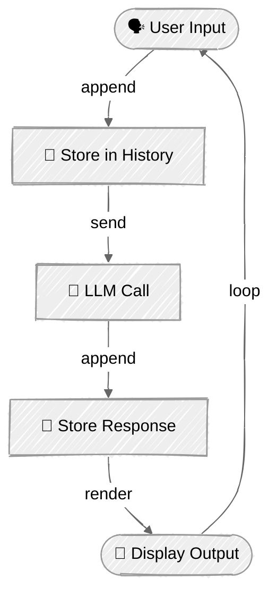

<!-- ---
title: "Interactive Chat"
description: "Build an interactive chat loop with message history using Anthropic Claude and OpenAI GPT"
icon: "message-circle"
--- -->

# Interactive Chat

Build an interactive chat application with conversation history management. This tutorial demonstrates how to maintain context across multiple turns and create an engaging conversational user experience.

## 🎯 What You'll Learn

- Implement an interactive chat loop with user input
- Manage conversation history across multiple turns
- Maintain context for natural multi-turn conversations
- Track token usage and conversation statistics
- Create rich console output for better UX

## 📦 Available Examples

| Provider                                        | File                                         | Description                                 |
| ----------------------------------------------- | -------------------------------------------- | ------------------------------------------- |
|  | [01_chat_anthropic.py](01_chat_anthropic.py) | Interactive chat using Claude Messages API  |
|        | [02_chat_openai.py](02_chat_openai.py)       | Interactive chat using OpenAI Responses API |

## 🚀 Quick Start

> **Prerequisites:** Python 3.11+, API keys, and uv. See [SETUP.md](../../SETUP.md) for full setup instructions.

```bash
uv run --directory 01-foundations/03-chat python {script_name}

# Example
uv run --directory 01-foundations/03-chat python 01_chat_anthropic.py
```

Or use the [Code Runner](https://marketplace.visualstudio.com/items?itemName=formulahendry.code-runner) VS Code extension to run the currently open script with a single click.

## 🔑 Key Concepts

### 1. Chat Loop Pattern



### 2. Message History Management

The key to multi-turn conversations is maintaining a message history array:

**Anthropic:**
```python
class ChatSession:
    def __init__(self, model: str):
        self.client = anthropic.Anthropic()
        self.messages: list[dict[str, str]] = []
        self.model = model

    def send_message(self, user_message: str) -> str:
        # Add user message to history
        self.messages.append({"role": "user", "content": user_message})

        # Send entire history to API
        response = self.client.messages.create(
            model=self.model,
            messages=self.messages,
        )

        # Extract response
        assistant_message = response.content[0].text

        # Add assistant response to history
        self.messages.append({"role": "assistant", "content": assistant_message})

        return assistant_message
```

**OpenAI:**
```python
class ChatSession:
    def __init__(self, model: str):
        self.client = OpenAI()
        self.messages: list[dict[str, str]] = []
        self.model = model

    def send_message(self, user_message: str) -> str:
        # Add user message to history
        self.messages.append({"role": "user", "content": user_message})

        # Send entire history to API using Responses API
        response = self.client.responses.create(
            model=self.model,
            input=self.messages,
        )

        # Extract response
        assistant_message = response.output_text or ""

        # Add assistant response to history
        self.messages.append({"role": "assistant", "content": assistant_message})

        return assistant_message
```

### 3. Interactive Chat Loop

Create a continuous conversation flow:

```python
def main() -> None:
    console = Console()
    chat = ChatSession("model-name")

    # Welcome message
    console.print(Panel("Welcome to Chat!"))

    # Interactive loop
    while True:
        # Get user input
        console.print("You: ", end="")
        user_input = input().strip()

        # Exit condition
        if user_input.lower() in ["quit", "exit", ""]:
            break

        # Process message
        try:
            response = chat.send_message(user_input)
            console.print(f"Assistant: {response}")
        except Exception as e:
            console.print(f"Error: {e}")
            break
```

### 4. Token Tracking

Monitor API usage across the conversation:

**Anthropic:**
```python
token_tracker = AnthropicTokenTracker()

# After each API call
response = self.client.messages.create(...)
token_tracker.track(response.usage)

# At end of session
token_tracker.report()  # Shows total input/output/cost
```

**OpenAI:**
```python
token_tracker = OpenAITokenTracker()

# After each API call
response = self.client.responses.create(...)
token_tracker.track(response.usage)

# At end of session
token_tracker.report()  # Shows total input/output/cost
```

## ⚠️ Important Considerations

**Context Window Limits**: As conversations grow, the message history consumes more tokens. Eventually, you'll hit the model's context window limit. Advanced techniques for handling this include:
- Truncating old messages
- Summarizing conversation history
- Using sliding windows

**Error Handling**: Production chat applications should handle:
- Network errors and API failures
- Rate limiting and retries
- Invalid user input
- Token limit exceeded errors

**Cost Management**: Every message sends the entire conversation history. Longer conversations = higher costs per message. Monitor token usage carefully.

These strategies will be covered in future tutorials.

## 👉 Next Steps

Once you've built interactive chat sessions, continue to:
- **[Tool Use](../04-tool-use/README.md)** - Add external capabilities to your chat agent
- **Experiment** - Try different conversation flows and system prompts
- **Enhance** - Add features like conversation summarization or history persistence
