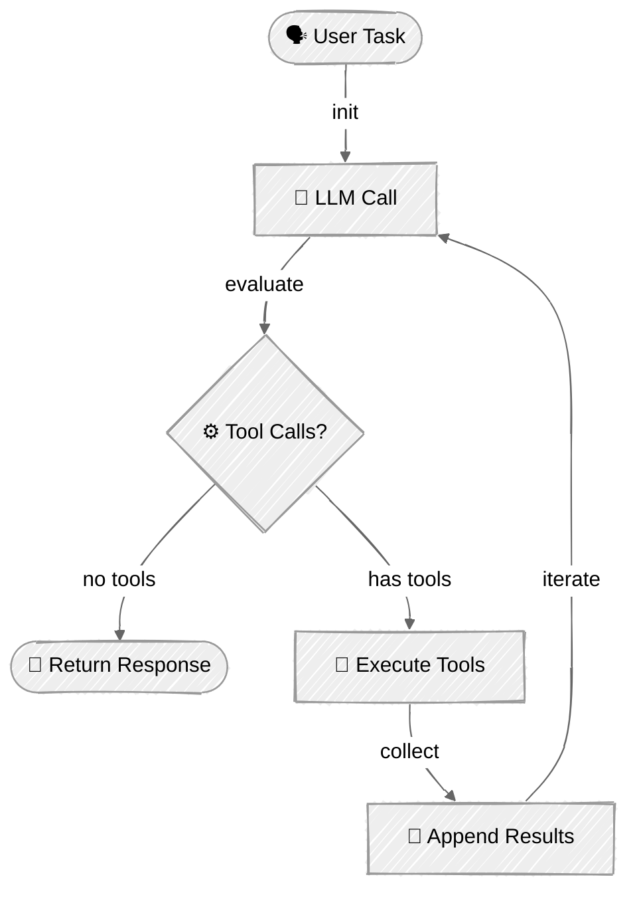

# Agent Loop

Learn how to build autonomous coding agents that use tools in a loop to complete tasks. This tutorial demonstrates the core pattern behind read_file, write_file, bash)
- Handle tool calls and results in conversation flow
- Build interactive CLI agents with proper error handling

## Available Examples

| Provider | File | Description |
|----------|------|-------------|
|  | [01_minimal_agent.py](01_minimal_agent.py) | Minimal agent loop (~55 lines) with human-in-the-loop confirmation |
|  | [01_agent_loop_anthropic.py](01_agent_loop_anthropic.py) | Full agent loop using Claude Messages API |
|  | [02_agent_loop_openai.py](02_agent_loop_openai.py) | Agent loop using OpenAI Responses API |

## Key Concepts

### 1. The Agent Loop Pattern

The core pattern is simple: call the LLM, execute any requested tools, feed results back, repeat until done.



```python
while iteration < max_iterations:
    # 1. Call the model with tools
    response = client.messages.create(
        model=model,
        tools=TOOLS,
        messages=messages,
    )

    # 2. If no tool calls, task is complete
    if response.stop_reason == "end_turn":
        return response.content[0].text

    # 3. Execute tools and collect results
    for tool_call in response.tool_calls:
        result = execute_tool(tool_call.name, tool_call.input)
        tool_results.append(result)

    # 4. Add results to conversation and continue
    messages.append(tool_results)
```

### 2. Tools

Tool definitions and execution are covered in [Tool Use](../04-tool-use/README.md). This tutorial uses three tools: `read_file`, `write_file`, and `bash`.

### 3. Appending Tool Results

**Anthropic** - Append assistant response and tool results as messages:
```python
messages.append({"role": "assistant", "content": response.content})
messages.append({"role": "user", "content": tool_results})
```

**OpenAI Responses API** - Pass tool outputs as `input` with `previous_response_id`:
```python
tool_outputs = [
    {
        "type": "function_call_output",
        "call_id": call.call_id,
        "output": json.dumps({"result": result}),
    }
    for call, result in zip(function_calls, results)
]
response = client.responses.create(
    model=model,
    tools=TOOLS,
    input=tool_outputs,
    previous_response_id=response.id,
)
```

## Code Structure

Both examples follow a consistent structure:

```python
SYSTEM_PROMPT = """You are a coding agent..."""

TOOLS = [...]  # Tool definitions

def execute_tool(name: str, tool_input: dict) -> str:
    """Execute a tool and return the result."""
    ...

class CodingAgent:
    """Autonomous agent that uses tools in a loop."""

    def __init__(self, model: str):
        self.client = ...
        self.model = model
        self.max_iterations = 10

    def run(self, task: str) -> str:
        """Execute the agent loop for the given task."""
        # Agent loop implementation
        ...

def main() -> None:
    """Interactive CLI with welcome message."""
    agent = CodingAgent()

    while True:
        user_input = input("You: ")
        if user_input.lower() in ("exit", "quit", "q"):
            break
        response = agent.run(user_input)
        print(f"Agent: {response}")
```


## Next Steps

Once you've mastered the agent loop pattern:
- Add more tools (web search, database queries, API calls)
- Implement tool confirmation for destructive actions
- Add memory/context management for longer conversations
- Explore streaming responses for better UX
