<!-- _class: lead invert -->

<span class="eyebrow">live demo companion · 30–45 min</span>

# 🤖 Agents Under the Hood
## from *stateless LLM calls* → an *agentic loop*

<br>

Four steps. Real code. Built live.

<br>

<span class="chip">loop</span> <span class="chip">tools</span> <span class="chip">context</span>

---

# 👋 How I Got Here

I started exploring agents a while ago and decided to share what I was learning along the way.

One of those posts —
**[How Agents Work: The Patterns Behind the Magic](https://agenticloopsai.substack.com/p/how-agents-work-the-patterns-behind)**
— is what led to this workshop.

---

# 🧠 First Principle — LLM Is a *Pure Function*

<span class="eyebrow">stateless · non-deterministic · token-bounded</span>

```python
response = llm(messages, tools, params)
```

- **No memory** between calls
- **You** keep the state, you replay it every turn
- Same input → *distribution* of outputs, not one answer

> Every "conversation" is the client stuffing history back into the prompt.

<span class="chip">stateless</span> <span class="chip">non-deterministic</span> <span class="chip">token-bounded</span>

---

# <span class="step-pill">Step 1</span> Simple LLM Call


<div class="columns">
<div>

### <span class="pros">✅ Pros</span>
- Stateless & predictable
- Easy to cache
- Cheapest possible call

</div>
<div>

### <span class="cons">⚠️ Cons</span>
- No memory
- No actions
- No grounding in reality

</div>
</div>

<span class="eyebrow">one prompt in, one answer out — the core building block of all LLM products</span>

---

# <span class="step-pill">Step 2</span> Chat — History Is State



<div class="columns">
<div>

### <span class="pros">✅ Pros</span>
- Natural multi-turn UX
- Context across messages
- Foundation for everything

</div>
<div>

### <span class="cons">⚠️ Cons</span>
- Context grows linearly → 💸
- Still **passive** — no actions
- Token bloat → drift

</div>
</div>

<span class="eyebrow">the client keeps the state · the LLM never remembers</span>

---

# <span class="step-pill">Step 3</span> Tool Use — Give It Hands



<div class="columns">
<div>

### <span class="pros">✅ Pros</span>
- LLM can **act** on the world
- Grounded in real data
- Structured I/O via JSON Schema

</div>
<div>

### <span class="cons">⚠️ Cons</span>
- Schemas eat tokens
- Selection errors at scale
- Needs **safety guardrails**

</div>
</div>

<span class="eyebrow">the LLM doesn't call functions · it requests them · YOU run them</span>

---

# <span class="step-pill">Step 4</span> Agent Loop — Autonomy



<div class="columns">
<div>

### <span class="pros">✅ Pros</span>
- Solves multi-step tasks
- Self-corrects on failure
- Composes tools dynamically

</div>
<div>

### <span class="cons">⚠️ Cons</span>
- Unbounded cost / loops
- Hard to debug
- Context pollution grows fast

</div>
</div>

<span class="eyebrow">think → act → observe → repeat</span>

---

# 🌐 MCP — Model Context Protocol



> **"USB for agent tools"** — one plug shape, any device.

<div class="columns">
<div>

### <span class="pros">✅ Pros</span>
- Plug-and-play integrations
- Decouples agent ↔ tools
- Reusable across clients (Cursor, Claude Code, ChatGPT…)

</div>
<div>

### <span class="cons">⚠️ Trade-offs</span>
- **Schema tax** — every tool loaded on every call
- **Choice paralysis** — more tools → worse selection
- **Security surface** — each server reads creds
- **Name collisions** — two `search` tools → mispicks

</div>
</div>

<span class="chip">standard</span> <span class="chip">pluggable</span> <span class="chip danger">schema tax</span>

---

# 📦 Skills — Lazy-Loaded Playbooks


**Anatomy:**

```
my-skill/
├── SKILL.md        # playbook + frontmatter (when to invoke)
├── scripts/helper.py
└── assets/template.docx
```

<div class="callout">💡 Unused skills <strong>never hit the context</strong> → ship 50 skills with ~zero baseline cost.</div>

<span class="chip ok">lazy-loaded</span> <span class="chip">prompt + code + assets</span> <span class="chip">convention > protocol</span>

---

# 🧹 Context Pollution — Reiteration



```python
prompt = (
    system_prompt         # ~500 tokens
    + tool_schemas        # ~6k × N servers
    + chat_history        # grows O(turns)
    + user_message        # tiny
)
```

> **Every token in context is a token the model must reason over.**
> Curate ruthlessly.

---

# 🗺️ What We've Built


| <span class="step-pill">1</span> | **LLM Call** | stateless request/response |
|:-:|---|---|
| <span class="step-pill">2</span> | **Chat** | conversation history |
| <span class="step-pill">3</span> | **Tool Use** | function calling |
| <span class="step-pill">4</span> | **Agent Loop** | autonomy + multi-step |

> You just went from a single LLM call to an autonomous agent.
> You're no longer a *consumer* — you're a *producer* of AI.

---

# 🤔 Why Learn This?

AI is moving fast — hard to separate **hype** from **substance**.
This technology isn't going anywhere. As engineers, we need to adapt.

<div class="columns">
<div>

### <span class="accent">Mid-90s → Early 2000s</span>
The web was new and confusing — then it changed everything.

Engineers who adapted (HTML → JS → frameworks) realized the web didn't *replace* software engineering — it *became part of it*.

</div>
<div>

### <span class="accent">AI Today</span>
Same arc. It won't replace software engineering — it'll **become part of it**.

Engineers who understand how agents work will build better systems, debug them more effectively, and design for AI's strengths *and* limits.

</div>
</div>

> Just as **HTTP and statelessness** made you a better web developer — **prompts, tools, memory, and failure modes** make you a better engineer in an AI-augmented world.

### 🎯 The goal isn't to become an AI specialist.

<span class="hand">It's to be fluent enough that when an agentic workflow is the right solution, you recognize it — and when it isn't, you recognize that too.</span>

---

<!-- _class: lead invert -->

# 🎯 From Consumer to Producer

An agent isn't a new kind of intelligence.
It's a **control flow** —
`while` loop + tools + history — around a stateless function.

<br>

🧱 Start simple → add primitives only when needed
🔧 Tools give power — schemas cost tokens
🌐 MCP adds more tools & integrations · 📦 Skills add on-demand playbooks
🧹 **Context is the new RAM — manage it**

<br>

### <span class="hand">Once you see the loop, you can build one tonight.</span>

<br>

### 📚 [agenticloops-ai / agentic-ai-engineering](https://github.com/agenticloops-ai/agentic-ai-engineering)

A hands-on guide to AI agent development — from basic LLM calls to autonomous tool-using systems. Progressive lessons, runnable code, both Anthropic & OpenAI.
