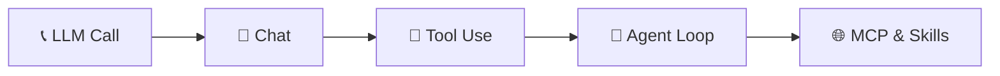
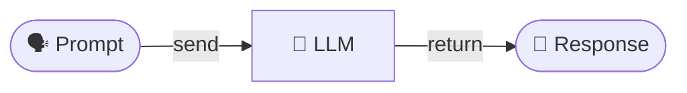
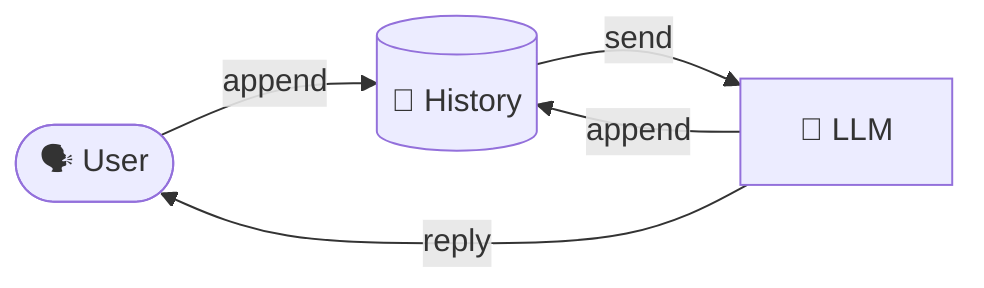
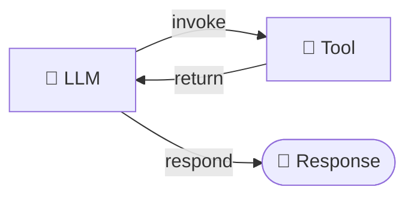
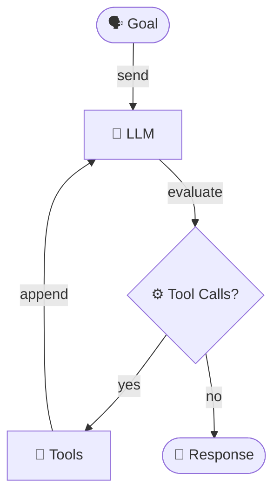
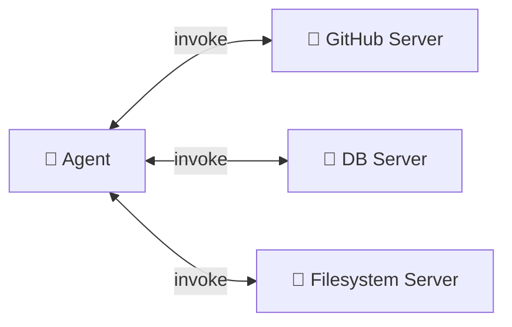
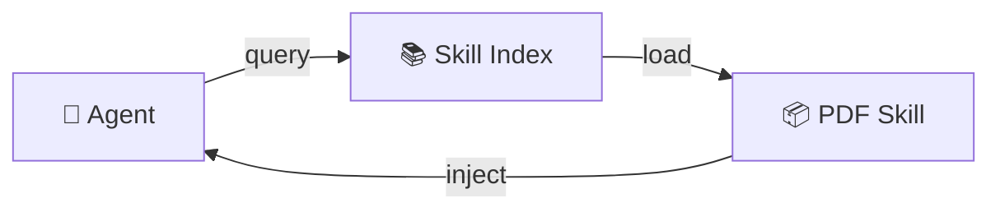
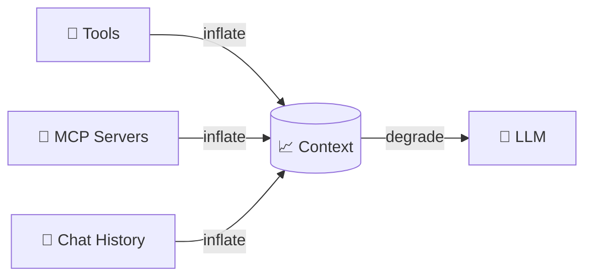

<!-- _class: lead invert -->

# 🤖 How Agents Work
## Building Agents from Scratch — Under the Hood

From a single LLM call → an autonomous agent loop

<br>

`workshop · 01-foundations`

---

# 👋 How I Got Here

I started exploring agents a while ago and decided to share what I was learning — I should have started earlier.

One of those posts —
*[How Agents Work: The Patterns Behind the Magic](https://agenticloopsai.substack.com/p/how-agents-work-the-patterns-behind)*
— caught <span class="accent">Yuriy's</span> eye, and here we are.

---

# 🤔 Why Understand the Internals?

AI is moving fast. Like any fast-growing technology, it's hard to separate **hype** from **substance**.

I look at it pragmatically:

> This technology isn't going anywhere.
> As engineers, we need to adapt and learn.

Understanding the patterns matters — just like it does for any other technology we use.

---

# 🌐 The Early Web Analogy

In the **mid-90s**, the internet was new and confusing.
By the **early 2000s**, it had changed everything.

> Not overnight. Not without mistakes. But **permanently**.

Some engineers adapted — HTML → JavaScript → frameworks — and realized the web didn't *replace* software engineering, it *became part of it*.

Others struggled.

---

# 🧭 AI Is the Same Story

It won't replace software engineering — it'll become **part of it**.

Engineers who understand how agents actually work will:

- 🏗️ build better systems
- 🐛 debug them more effectively
- 🎯 design for AI's strengths and its limits

Just as understanding HTTP and statelessness made you a better web developer — understanding **prompts, tools, memory, and failure modes** will make you a better engineer in an AI-augmented world.

---

<!-- _class: lead invert -->

# 🎯 The Goal

The goal isn't to become an **AI specialist**.

<br>

It's to be **fluent enough** that
when an agentic workflow is the right solution,
you recognize it —

<br>

and when it isn't,
**you recognize that too.**

---

# 🗺️ The Progression



| # | Pattern | Adds |
|:-:|---------|------|
| 1 | **Simple LLM Call** | Stateless request/response |
| 2 | **Chat** | Conversation history |
| 3 | **Tool Use** | Function calling |
| 4 | **Agent Loop** | Autonomy + multi-step reasoning |
| ➕ | **MCP / Skills** | Scalable context engineering |

> Every "agent" is a composition of these primitives.

---

# 1️⃣ Simple LLM Call



<div class="columns">
<div>

### <span class="pros">✅ Pros</span>
- Stateless & predictable
- Easy to cache
- Cheapest possible call
- Great for one-shot tasks

</div>
<div>

### <span class="cons">⚠️ Cons</span>
- No memory
- No actions
- No iteration
- No grounding in reality

</div>
</div>

```python
response = client.messages.create(
    model="claude-sonnet-4-6",
    system="You are a helpful assistant.",
    messages=[{"role": "user", "content": prompt}],
)
return response.content[0].text
```

---

# 2️⃣ Chat — Add Memory



<div class="columns">
<div>

### <span class="pros">✅ Pros</span>
- Natural multi-turn UX
- Context across messages
- Foundation for everything

</div>
<div>

### <span class="cons">⚠️ Cons</span>
- Context grows linearly → 💸
- Still **passive** — no actions
- Token bloat → drift & latency

</div>
</div>

```python
self.messages.append({"role": "user", "content": user_message})
response = self.client.messages.create(
    model=self.model, messages=self.messages,
)
self.messages.append({"role": "assistant", "content": response.content[0].text})
```

---

# 3️⃣ Tool Use — Add Actions



<div class="columns">
<div>

### <span class="pros">✅ Pros</span>
- LLM can **act** on the world
- Grounded answers (real data)
- Structured I/O via JSON Schema

</div>
<div>

### <span class="cons">⚠️ Cons</span>
- Tool schemas eat tokens
- Selection errors at scale
- Needs **safety guardrails**

</div>
</div>

```python
TOOLS = [{"name": "calculator", "input_schema": {...}}]
response = client.messages.create(model=model, tools=TOOLS, messages=messages)
for block in response.content:
    if isinstance(block, ToolUseBlock):
        result = execute_tool(block.name, block.input)
```

---

# 4️⃣ Agent Loop — Add Autonomy



<div class="columns">
<div>

### <span class="pros">✅ Pros</span>
- Solves multi-step tasks
- Self-corrects on failure
- Composes tools dynamically

</div>
<div>

### <span class="cons">⚠️ Cons</span>
- Unbounded cost / loops
- Hard to debug
- **Context pollution** grows fast

</div>
</div>

```python
while iteration < max_iterations:
    response = client.messages.create(model=model, tools=TOOLS, messages=messages)
    if response.stop_reason == "end_turn":
        return response.content[0].text
    messages.append({"role": "assistant", "content": response.content})
    messages.append({"role": "user", "content": run_tools(response)})
```

---

# 🌐 MCP — Model Context Protocol



> **"USB-C for LLM tools"** — one protocol, many integrations.

<div class="columns">
<div>

### <span class="pros">✅ Pros</span>
- Plug-and-play tool ecosystems
- Decouples agent ↔ tools
- Reusable across clients

</div>
<div>

### <span class="cons">⚠️ Cons</span>
- **Every MCP loads its full tool list** into context
- Selection accuracy ↓ as N tools ↑
- Auth, sandboxing, trust boundaries

</div>
</div>

### 📊 Real MCP servers — tool counts add up fast

| MCP Server | Tools | ~Schema tokens |
|---|:-:|:-:|
| **GitHub** (issues, PRs, commits, branches, releases…) | ~35 | ~6k |
| **Playwright** (browser automation) | ~25 | ~5k |
| **Atlassian** (Jira + Confluence) | ~30 | ~5k |
| **AWS** (S3, EC2, Lambda…) | 100+ | 20k+ |
| **Filesystem + Slack + Postgres** (typical combo) | ~30 | ~5k |

> Connect 3–4 servers → **15k+ tokens consumed before the user even types a prompt.**

---

# 📦 Skills — Progressive Disclosure



> Skills = **lazy-loaded capability bundles** (instructions + code + resources).

<div class="columns">
<div>

### <span class="pros">✅ Pros</span>
- Loaded **only when relevant**
- Keeps base context lean
- Versioned, shareable, composable

</div>
<div>

### <span class="cons">⚠️ Cons</span>
- Discovery overhead
- Skill quality = agent quality
- Still trades context for capability

</div>
</div>

---

# ⚠️ The Context Pollution Problem



| Scaling Lever | Cost in Context | Symptom |
|---------------|-----------------|---------|
| More tools | Schemas in every call | Wrong tool selected |
| More MCP servers | Full toolset always loaded | Token bloat, latency |
| Longer history | O(n) growth | Forgetfulness, drift |
| More skills (eager) | Instructions duplicated | Confused priorities |

> **Rule of thumb:** every token in context is a token the model must reason over. Curate ruthlessly.

---

<!-- _class: lead invert -->

# 🎯 Takeaways

**Agents = LLM + Loop + Tools + Context Engineering**

🧱 Start simple → add primitives only when needed
🔧 Tools give power — schemas cost tokens
🔁 The loop is ~30 lines of code
🌐 MCP scales integrations, not context
📦 Skills load capabilities on demand
🧹 **Context is the new RAM — manage it**

<br>

### 🚀 Build one. Break it. Then scale it.

`github.com/agenticloops-ai/agentic-ai-engineering`
