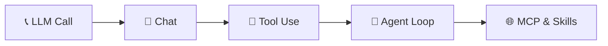
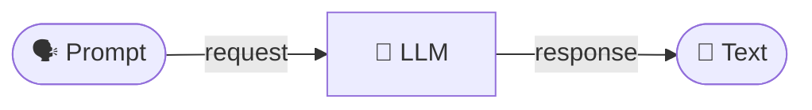
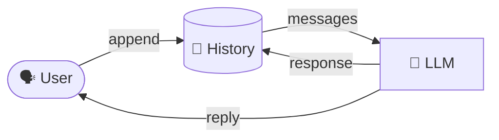
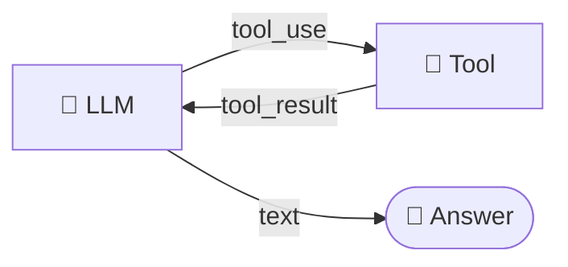
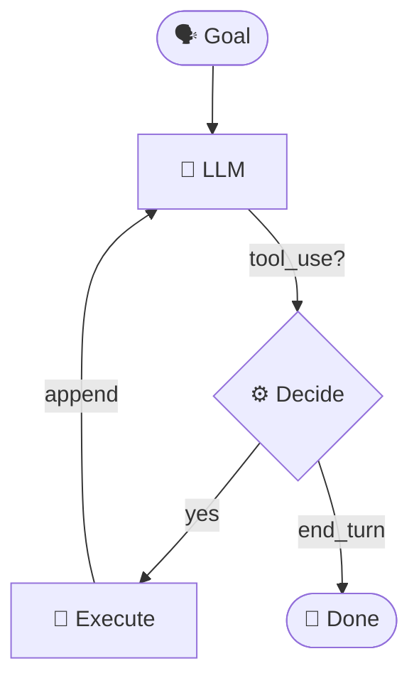
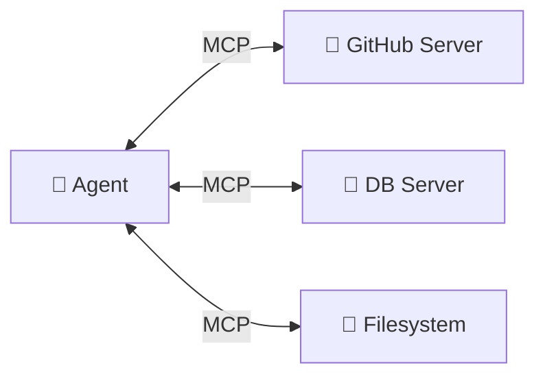
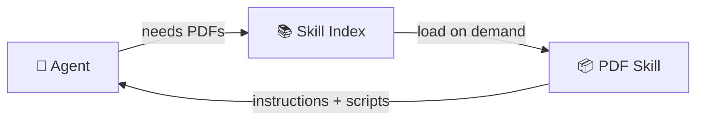
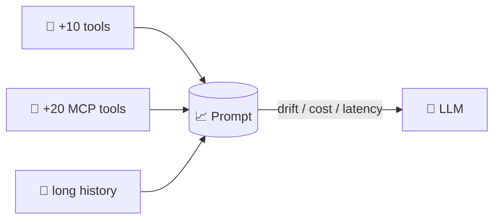

<!-- _class: lead invert -->

# 🤖 How Agents Work
## Building Agents from Scratch — Under the Hood

From a single LLM call → an autonomous agent loop

<br>

`workshop · 01-foundations`

---

# 🗺️ The Progression



| # | Pattern | Adds |
|:-:|---------|------|
| 1 | **Simple LLM Call** | Stateless request/response |
| 2 | **Chat** | Conversation history |
| 3 | **Tool Use** | Function calling |
| 4 | **Agent Loop** | Autonomy + multi-step reasoning |
| ➕ | **MCP / Skills** | Scalable context engineering |

> Every "agent" is a composition of these primitives.

---

# 1️⃣ Simple LLM Call



<div class="columns">
<div>

### <span class="pros">✅ Pros</span>
- Stateless & predictable
- Easy to cache
- Cheapest possible call
- Great for one-shot tasks

</div>
<div>

### <span class="cons">⚠️ Cons</span>
- No memory
- No actions
- No iteration
- No grounding in reality

</div>
</div>

```python
response = client.messages.create(
    model="claude-sonnet-4-6",
    system="You are a helpful assistant.",
    messages=[{"role": "user", "content": prompt}],
)
return response.content[0].text
```

---

# 2️⃣ Chat — Add Memory



<div class="columns">
<div>

### <span class="pros">✅ Pros</span>
- Natural multi-turn UX
- Context across messages
- Foundation for everything

</div>
<div>

### <span class="cons">⚠️ Cons</span>
- Context grows linearly → 💸
- Still **passive** — no actions
- Token bloat → drift & latency

</div>
</div>

```python
self.messages.append({"role": "user", "content": user_message})
response = self.client.messages.create(
    model=self.model, messages=self.messages,
)
self.messages.append({"role": "assistant", "content": response.content[0].text})
```

---

# 3️⃣ Tool Use — Add Actions



<div class="columns">
<div>

### <span class="pros">✅ Pros</span>
- LLM can **act** on the world
- Grounded answers (real data)
- Structured I/O via JSON Schema

</div>
<div>

### <span class="cons">⚠️ Cons</span>
- Tool schemas eat tokens
- Selection errors at scale
- Needs **safety guardrails**

</div>
</div>

```python
TOOLS = [{"name": "calculator", "input_schema": {...}}]
response = client.messages.create(model=model, tools=TOOLS, messages=messages)
for block in response.content:
    if isinstance(block, ToolUseBlock):
        result = execute_tool(block.name, block.input)
```

---

# 4️⃣ Agent Loop — Add Autonomy



<div class="columns">
<div>

### <span class="pros">✅ Pros</span>
- Solves multi-step tasks
- Self-corrects on failure
- Composes tools dynamically

</div>
<div>

### <span class="cons">⚠️ Cons</span>
- Unbounded cost / loops
- Hard to debug
- **Context pollution** grows fast

</div>
</div>

```python
while iteration < max_iterations:
    response = client.messages.create(model=model, tools=TOOLS, messages=messages)
    if response.stop_reason == "end_turn":
        return response.content[0].text
    messages.append({"role": "assistant", "content": response.content})
    messages.append({"role": "user", "content": run_tools(response)})
```

---

# 🌐 MCP — Model Context Protocol



> **"USB-C for LLM tools"** — one protocol, many integrations.

<div class="columns">
<div>

### <span class="pros">✅ Pros</span>
- Plug-and-play tool ecosystems
- Decouples agent ↔ tools
- Reusable across clients

</div>
<div>

### <span class="cons">⚠️ Cons</span>
- **Every MCP loads its full tool list** into context
- 5 servers → 100+ tools → 🤯
- Selection accuracy ↓ as N tools ↑
- Auth, sandboxing, trust boundaries

</div>
</div>

```python
# Connect once → tools auto-injected into every LLM call
client.add_mcp_server("github")  # +20 tools, +4k tokens... per turn
```

---

# 📦 Skills — Progressive Disclosure



> Skills = **lazy-loaded capability bundles** (instructions + code + resources).

<div class="columns">
<div>

### <span class="pros">✅ Pros</span>
- Loaded **only when relevant**
- Keeps base context lean
- Versioned, shareable, composable

</div>
<div>

### <span class="cons">⚠️ Cons</span>
- Discovery overhead
- Skill quality = agent quality
- Still trades context for capability

</div>
</div>

---

# ⚠️ The Context Pollution Problem



| Scaling Lever | Cost in Context | Symptom |
|---------------|-----------------|---------|
| More tools | Schemas in every call | Wrong tool selected |
| More MCP servers | Full toolset always loaded | Token bloat, latency |
| Longer history | O(n) growth | Forgetfulness, drift |
| More skills (eager) | Instructions duplicated | Confused priorities |

> **Rule of thumb:** every token in context is a token the model must reason over. Curate ruthlessly.

---

<!-- _class: lead invert -->

# 🎯 Takeaways

**Agents = LLM + Loop + Tools + Context Engineering**

🧱 Start simple → add primitives only when needed
🔧 Tools give power — schemas cost tokens
🔁 The loop is ~30 lines of code
🌐 MCP scales integrations, not context
📦 Skills load capabilities on demand
🧹 **Context is the new RAM — manage it**

<br>

### 🚀 Build one. Break it. Then scale it.

`github.com/agenticloops-ai/agentic-ai-engineering`
