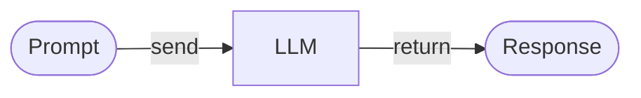
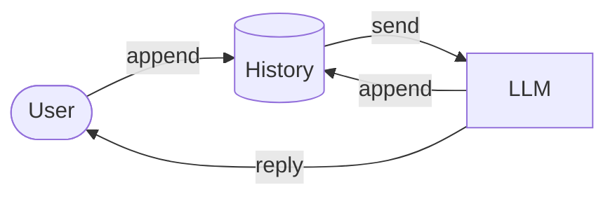
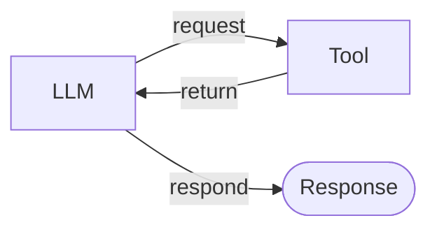
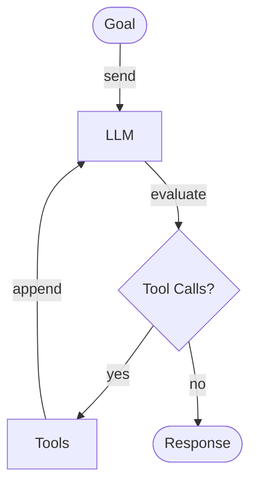
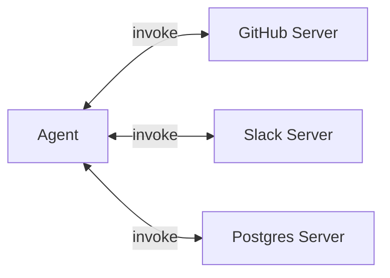
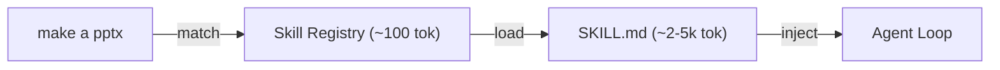
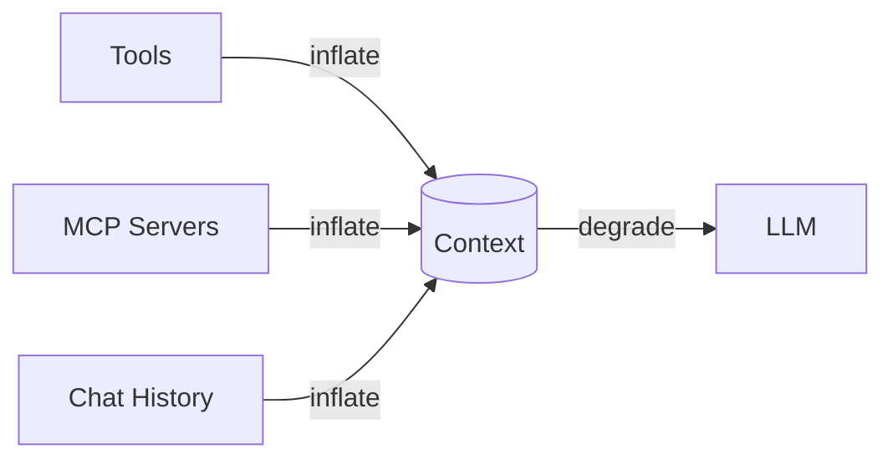
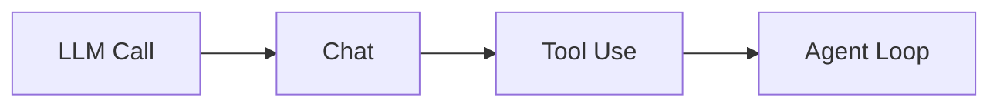

# Agents Under the Hood

From stateless LLM calls to an agentic loop.

*Live demo companion · 30–45 min*

---

## How I Got Here

I started exploring agents a while ago and decided to share what I was learning along the way.

One of those posts — [How Agents Work: The Patterns Behind the Magic](https://agenticloopsai.substack.com/p/how-agents-work-the-patterns-behind) — is what led to this workshop.

---

## First Principle — LLM Is a Pure Function

```python
response = llm(messages, tools, params)
```

- **No memory** between calls
- **You** keep the state, you replay it every turn
- Same input → *distribution* of outputs, not one answer

> Every "conversation" is the client stuffing history back into the prompt.

---

## Step 1 — Simple LLM Call



**Pros:** stateless, predictable, cheap, cacheable.
**Cons:** no memory, no actions, no grounding.

*One prompt in, one answer out — the core building block of all LLM products.*

---

## Step 2 — Chat (History Is State)



**Pros:** natural multi-turn UX, foundation for everything.
**Cons:** context grows linearly, still passive, token bloat → drift.

*The client keeps the state. The LLM never remembers.*

---

## Step 3 — Tool Use (Give It Hands)



**Pros:** LLM can act on the world, grounded in real data, structured I/O.
**Cons:** schemas eat tokens, selection errors at scale, needs safety guardrails.

*The LLM doesn't call functions — it requests them. You run them.*

---

## Step 4 — Agent Loop (Autonomy)



**Pros:** solves multi-step tasks, self-corrects, composes tools dynamically.
**Cons:** unbounded cost, hard to debug, context pollution grows fast.

*Think → act → observe → repeat.*

---

## MCP — Model Context Protocol



> "USB for agent tools" — one plug shape, any device.

**Pros:** plug-and-play, decoupled, reusable across clients.
**Trade-offs:** schema tax, choice paralysis, security surface, name collisions.

---

## Skills — Lazy-Loaded Playbooks



```
my-skill/
├── SKILL.md        # playbook + frontmatter
├── scripts/helper.py
└── assets/template.docx
```

Unused skills never hit the context → ship 50 skills with ~zero baseline cost.

---

## Context Pollution



```
prompt = system_prompt       # ~500 tokens
       + tool_schemas         # ~6k × N servers
       + chat_history         # grows O(turns)
       + user_message         # tiny
```

> Every token in context is a token the model must reason over.

---

## What We've Built



| # | Pattern | Adds |
|---|---------|------|
| 1 | LLM Call | stateless request/response |
| 2 | Chat | conversation history |
| 3 | Tool Use | function calling |
| 4 | Agent Loop | autonomy + multi-step |

You just went from a single LLM call to an autonomous agent.

---

## Why Learn This?

AI is moving fast — hard to separate hype from substance.
This technology isn't going anywhere. As engineers, we need to adapt.

**Mid-90s → Early 2000s:** the web was new and confusing — then it changed everything. Engineers who adapted (HTML → JS → frameworks) realized the web didn't *replace* software engineering — it *became part of it*.

**AI today:** same arc. Engineers who understand how agents work will build better systems, debug more effectively, and design for AI's strengths *and* limits.

> The goal isn't to become an AI specialist. It's to be fluent enough to recognize when an agentic workflow is the right solution — and when it isn't.

---

## From Consumer to Producer

An agent isn't a new kind of intelligence.
It's a **control flow** — `while` loop + tools + history — around a stateless function.

- Start simple → add primitives only when needed
- Tools give power — schemas cost tokens
- MCP adds more tools & integrations · Skills add on-demand playbooks
- **Context is the new RAM — manage it**

### 📚 [agenticloops-ai / agentic-ai-engineering](https://github.com/agenticloops-ai/agentic-ai-engineering)

A hands-on guide to AI agent development — from basic LLM calls to autonomous tool-using systems.
