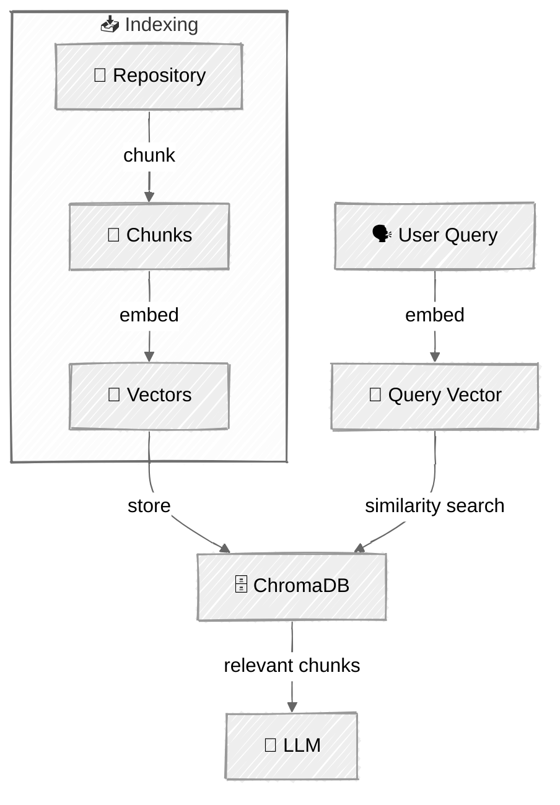

<!-- ---
title: "Augmented LLM"
description: "The basic building block of agentic systems — an LLM enhanced with retrieval, tools, and memory"
icon: "layers"
status: "coming-soon"
--- -->

# Augmented LLM

The basic building block of agentic systems is an LLM enhanced with augmentations such as retrieval, tools, and memory. Modern models can actively use these capabilities — generating their own search queries, selecting appropriate tools, and determining what information to retain.

> Based on the [Augmented LLM](https://www.anthropic.com/engineering/building-effective-agents) pattern from Anthropic's "Building Effective Agents" guide.

This tutorial implements a **Codebase Navigator** — an agent that helps engineers explore and understand unfamiliar codebases. Point it at any GitHub repo, and it will clone, index, and answer questions using semantic search while maintaining memory across sessions.


> **📚 Setup & Running:** See [SETUP.md](../../SETUP.md) for prerequisites, setup instructions, and how to run tutorials.

## 🎯 What You'll Learn

- Understand the **Augmented LLM** as the foundation of all agentic patterns
- Implement **retrieval augmentation (RAG)** with ChromaDB and sentence-transformers
- Connect LLMs to **tools** they can invoke autonomously via the agentic loop
- Add persistent **memory** to maintain context across sessions
- Build a practical agent that explores real codebases

## 📦 Available Examples

| # | Script | Provider | What it demonstrates |
|---|--------|----------|---------------------|
| 01 | `01_augmented_llm.py` |  | Full augmented LLM with RAG, tools, and memory |

> **Contributions welcome!** We're looking for help porting this tutorial to additional providers. See [#11 — Port to OpenAI API](https://github.com/agenticloops-ai/ai-agents-engineering/issues/11) if you'd like to contribute.

## 🔑 Key Concepts

### Augmentations

**Retrieval (RAG)** — Semantic search over indexed codebases using ChromaDB and sentence-transformers. The agent generates search queries to find relevant code chunks based on meaning, not just keywords.

| Component | Description |
|-----------|-------------|
| **Vector Store** | Local ChromaDB containing embedded code chunks |
| **Chunking** | Tree-sitter for AST-aware chunking (functions, classes, modules) |
| **Embeddings** | Sentence-transformers (`all-MiniLM-L6-v2`) for local embeddings |

**Tools** — Clone repos, read files, search code, grep for patterns. The LLM decides which tools to use and when, executing them through Anthropic's native tool use API.

| Tool | Purpose | Example use |
|------|---------|-------------|
| `clone_and_index` | Clone and index a GitHub repo | "index pallets/flask" |
| `list_repos` | List all indexed repositories | "what repos do I have?" |
| `search_code` | Semantic search over code | "how does routing work?" |
| `read_file` | Read file with line numbers | reading a specific file |
| `list_directory` | Explore repo structure | "show me the project layout" |
| `grep` | Regex pattern search | "find all TODO comments" |
| `save_memory` | Persist a fact/insight/preference | automatic when discovering patterns |
| `recall_memory` | Retrieve stored memories | automatic at session start |

**Memory** — Persistent JSON storage for facts, insights, and user preferences. Memory is loaded into the system prompt at the start of each session, giving the agent context from previous conversations.

Enables context-aware follow-ups like:
  > *"Earlier you found the auth logic in `src/auth/` — want me to look for related middleware?"*

### The Agentic Loop

The core pattern that makes this work (same as the [Agent Loop](../../01-foundations/05-agent-loop/README.md) tutorial).

The loop continues until the LLM responds with just text (no tool calls), indicating it has enough information to answer.

### RAG Pipeline



**Chunking strategy**: Python files split on top-level `class`/`def` definitions. Other files split every 50 lines with 10-line overlap. Simple heuristics that work well for educational purposes.

**Embedding model**: `all-MiniLM-L6-v2` via sentence-transformers — lightweight, runs locally, no external API needed.

## 🏗️ Code Structure

```
01-augmented-llm/
├── 01_augmented_llm.py             # Main entry point — agent + CLI
├── store/
│   ├── memory.py                   # JSON-based persistent memory
│   └── vector.py                   # ChromaDB wrapper for embeddings
├── indexer/
│   ├── chunker.py                  # File chunking strategies
│   └── embedder.py                 # Sentence-transformer embeddings
├── tools/
│   ├── memory.py                   # save_memory, recall_memory
│   ├── repo.py                     # clone_and_index, list_repos
│   ├── files.py                    # read_file, list_directory
│   └── search.py                   # search_code, grep
├── repos/                          # Cloned repositories (gitignored)
├── data/                           # ChromaDB persistence (gitignored)
└── memory.json                     # Persistent memory (gitignored)
```

## 💬 Example Session

```
Codebase Navigator

> index the flask repo from pallets/flask
  [tool: clone_and_index] {"repo":"pallets/flask"}
  → Indexed 'pallets/flask': 142 files, 847 chunks. Ready to search!

Navigator:
Indexed pallets/flask successfully. What would you like to explore?

> how does routing work?
  [tool: search_code] {"query":"routing request handling","repo":"pallets-flask"}
  → Search results for: 'routing request handling'

Navigator:
Flask's routing is built on Werkzeug's routing system. Here's how it works:

1. **Route Registration** (`src/flask/scaffold.py:42`)
   Routes are registered via the `@app.route()` decorator...

2. **URL Map** (`src/flask/app.py:315`)
   Flask maintains a Werkzeug `Map` object...

> find all TODO comments
  [tool: grep] {"pattern":"TODO","repo":"pallets-flask"}
  → Found 3 matches for `TODO`

Navigator:
Found 3 TODO comments in the Flask codebase:
- `src/flask/testing.py:89` — TODO: deprecate this in 3.1
...
```

## ⚠️ Important Considerations

- **Embedding model choice** — we use `all-MiniLM-L6-v2` because it's small (~80MB), runs locally with no extra API key, and is good enough for teaching RAG. For production code search, consider a code-specific model (e.g., CodeBERT or OpenAI embeddings)
- **Embedding model downloads on first run** — the model is downloaded once from HuggingFace and cached locally
- **Large repos take time to index** — chunking and embedding hundreds of files requires patience
- **ChromaDB persists locally** — indexed repos are stored in `./data/chroma/` and survive restarts
- **Memory grows unbounded** — in production, you'd want to limit or summarize old memories
- **No AST parsing** — chunking uses simple line-based heuristics, not language-aware parsing

## 👉 Next Steps

- **[Prompt Chaining](../02-prompt-chaining/README.md)** — decompose tasks into sequential LLM calls
- Try indexing multiple repos and asking cross-repo questions
- Experiment with different embedding models
- Add new tools (e.g., `run_tests`, `explain_function`)
- Try different chunking strategies for better search results
