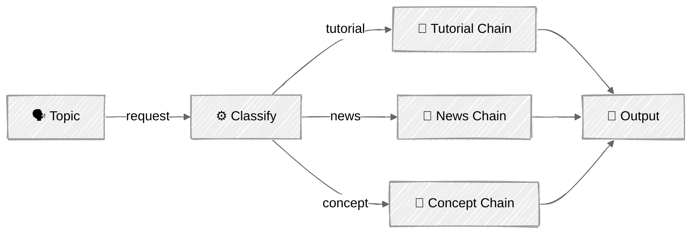

<!-- ---
title: "Routing"
description: "Classify incoming requests and dispatch them to specialized handlers"
icon: "split"
--- -->

# Routing — The Content Strategist

Route to specialized handlers based on content analysis. The router picks the right *structure*, not just the right tone — wrong routing means wrong output format entirely.

## 🎯 What You'll Learn

- Classify inputs using LLM-powered structured output (tool use)
- Design specialized chains for structurally different content types
- Understand why generic prompts produce mediocre results
- Build a classifier → specialized chain routing system

## 📦 Available Examples

| Provider | File | Description |
|----------|------|-------------|
|  | [01_routing.py](01_routing.py) | Content strategist with 3 specialized routes |

## 🚀 Quick Start

> **Prerequisites:** Python 3.11+, API keys, and uv. See [SETUP.md](../../SETUP.md) for full setup instructions.

```bash
uv run --directory 02-effective-agents/02-routing python {script_name}

# Example
uv run --directory 02-effective-agents/02-routing python 01_routing.py
```

Or use the [Code Runner](https://marketplace.visualstudio.com/items?itemName=formulahendry.code-runner) VS Code extension to run the currently open script with a single click.

## 🔑 Key Concepts

### Classification with Structured Output

Uses Anthropic's `tool_choice` to force structured classification output — no parsing needed:

```python
tool_choice={"type": "tool", "name": "classify_content"}
```

The classifier returns a `content_type` (tutorial, news, concept) and `reasoning` for transparency. By forcing a tool call, the output is always valid JSON matching the schema — no regex or string parsing required.

### Specialized Routes

Each route is a mini prompt chain optimized for that content structure:

- **Tutorial** (how-to): Prerequisites → Step-by-Step → Troubleshooting
- **News/Announcement**: Summary of Changes → Impact Analysis → Call to Action
- **Concept Explainer**: Analogy → Architecture Description → Pros/Cons

The key insight: a tutorial needs prerequisites before steps, a news article needs impact analysis, and a concept explainer needs analogies. A single generic prompt can't produce all three structures well.

### Routing vs. Chaining

Routing builds on prompt chaining (each route *is* a chain) but adds a classification step that determines which chain to execute:



Use routing when inputs require **structurally different** processing, not just different tones or styles.

### Callback Pattern

Like the prompt chaining tutorial, the `ContentRouter` class emits events via a callback rather than printing directly. This keeps the class UI-agnostic — the `main()` function decides how to render events:

```python
RouterCallback = Callable[[str, dict[str, Any]], None]
```

Events: `classify_start`, `classify_complete`, `chain_start`, `chain_complete`.

## ⚠️ Important Considerations

- Classification accuracy is critical — wrong route = wrong output format
- Keep routes distinct. If two routes overlap heavily, they should be one route
- The classifier prompt needs clear, unambiguous category definitions
- Each route adds its own chain of LLM calls — token cost scales with route complexity

## 👉 Next Steps

- [03 - Parallelization](../03-parallelization/) — fan-out work across independent LLM calls
- Experiment: add a 4th route (e.g., "Opinion/Editorial" with a different structure)
