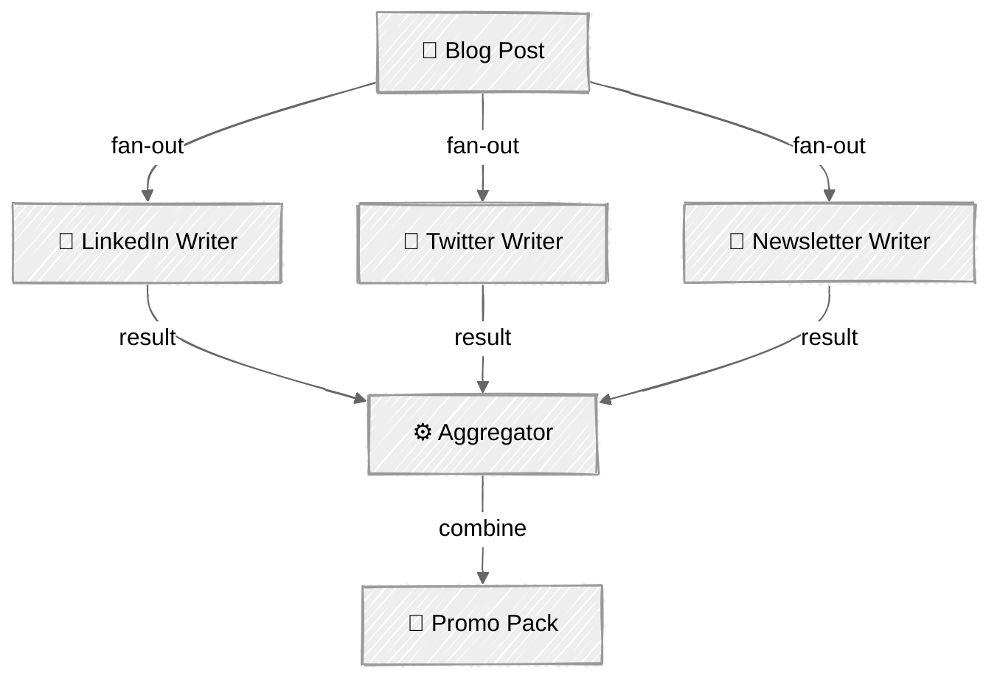
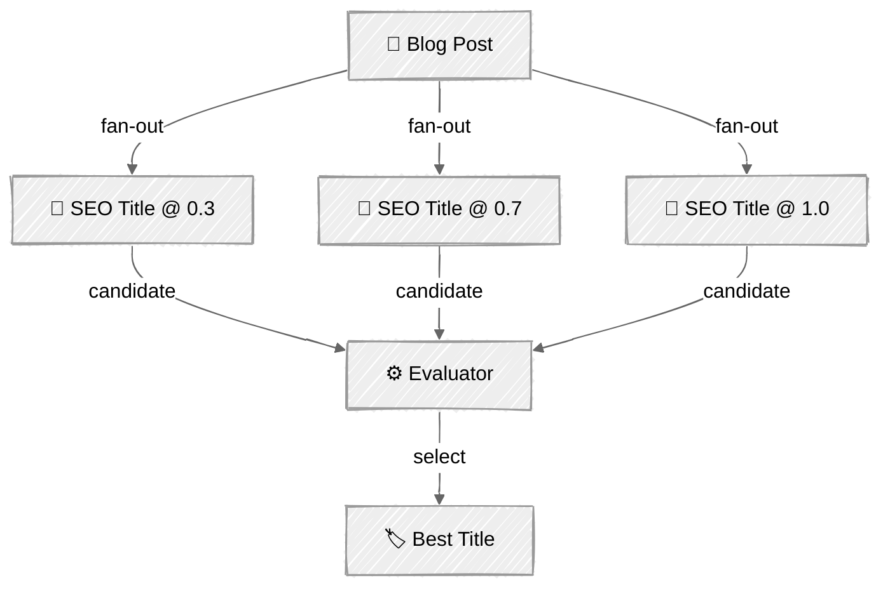

<!-- ---
title: "Parallelization"
description: "Fan-out work across multiple LLM calls simultaneously, then aggregate results"
icon: "layers"
--- -->

# Parallelization — The Social Media Blast

Fan-out for independent work, fan-in to combine. Independent tasks run concurrently (faster), then aggregate into a single deliverable. Tasks must be truly independent — if task B depends on task A's output, don't parallelize them.

## 🎯 What You'll Learn

- Fan-out independent LLM calls using `ThreadPoolExecutor`
- Aggregate parallel results into a combined output
- Implement the voting pattern: generate candidates at different temperatures, then evaluate
- Decouple pipeline logic from UI with event callbacks
- Understand when tasks are truly independent vs. when they have dependencies

## 📦 Available Examples

| Provider | File | Description |
|----------|------|-------------|
|  | [01_parallelization.py](01_parallelization.py) | Social media promo pack + SEO title voting |

## 🚀 Quick Start

> **Prerequisites:** Python 3.11+, API keys, and uv. See [SETUP.md](../../SETUP.md) for full setup instructions.

```bash
uv run --directory 02-effective-agents/03-parallelization python {script_name}

# Example
uv run --directory 02-effective-agents/03-parallelization python 01_parallelization.py
```

Or use the [Code Runner](https://marketplace.visualstudio.com/items?itemName=formulahendry.code-runner) VS Code extension to run the currently open script with a single click.

## 🔑 Key Concepts

### Fan-out / Fan-in

A blog post (selected from `input/` or pasted custom) is sent to 3 independent writers simultaneously:



Each writer has a focused system prompt and runs as a separate thread. Results are collected as they complete and aggregated into a "Promo Pack" saved to `output/`.

### Voting Pattern

Generate 3 SEO title candidates at different temperatures (0.3, 0.7, 1.0), then use an evaluator to pick the best one:



Lower temperatures produce safe, predictable titles. Higher temperatures produce creative, surprising ones. The evaluator picks the best from a diverse candidate pool — more variety in, better selection out.

### Thread Safety

The Anthropic Python client is thread-safe. Each `ThreadPoolExecutor` worker makes its own API call independently. Token tracking uses simple integer addition (safe for this use case).

### Event Callbacks

The `ParallelContentGenerator` class emits events (`fanout_start`, `writer_complete`, `voting_start`, etc.) via a callback — the caller decides how to render progress. This keeps the pipeline logic free of UI concerns:

```python
def run(self, blog_post: str, on_event: GeneratorCallback | None = None) -> dict[str, str]:
```

This is the same pattern used in [01 - Prompt Chaining](../01-prompt-chaining/) for step progress.

## ⚠️ Important Considerations

- Tasks must be truly independent — if task B depends on task A's output, don't parallelize
- More concurrent calls = higher burst API usage. Watch rate limits
- Error handling per-task: one failure shouldn't crash the whole fan-out
- Thread count should match the number of independent tasks, not exceed it

## 👉 Next Steps

- [04 - Orchestrator-Workers](../04-orchestrator-workers/) — let the LLM dynamically decide what to parallelize
- Experiment: add `asyncio` with `anthropic.AsyncAnthropic` for async parallelization
