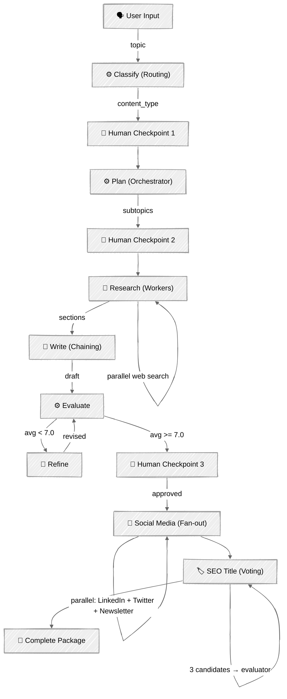

<!-- ---
title: "Content Writer"
description: "Production content writer agent combining all workflow patterns with Pydantic models and async event streaming"
icon: "pen-tool"
--- -->

# Content Writer — The Full Agent

A production-ready content creation pipeline that composes **all six patterns** from this module into one agent with social media parallelization, SEO title voting, Pydantic data models, and a typed async event system for clean UI/agent separation.

## 🎯 What You'll Learn

- Compose routing, orchestration, parallelization, evaluation, and human checkpoints into a single pipeline
- Use **Pydantic models** for validated structured output and typed event streaming
- Use **async generators** to decouple agent logic from UI rendering
- Apply the **fan-out** pattern (social media) and **voting** pattern (SEO titles) from tutorial 04
- Write production-quality prompts: writing voice, anti-AI patterns, type-specific instructions
- Balance token efficiency with output quality (dual models, focused research, selective truncation)

## 📦 Available Examples

| Provider | File | Description |
|----------|------|-------------|
|  | [01_content_writer.py](01_content_writer.py) | Entry point: async event consumer + Rich UI |
| | [content_writer/models.py](content_writer/models.py) | Pydantic data models + typed event system |
| | [content_writer/agent.py](content_writer/agent.py) | Agent class with `run_stream()` async generator |
| | [content_writer/prompts.py](content_writer/prompts.py) | Production-quality system prompts |
| | [content_writer/tools.py](content_writer/tools.py) | Tool schemas for structured output + web search |

## 🚀 Quick Start

> **Prerequisites**: See [SETUP.md](../../SETUP.md) for environment setup.

```bash
uv run --directory 02-effective-agents/08-content-writer python 01_content_writer.py
```

## 🏗️ Architecture

```
08-content-writer/
├── 01_content_writer.py             # Entry point: async event consumer + Rich UI
└── content_writer/                  # Agent package
    ├── __init__.py
    ├── models.py                    # Pydantic models + 20 typed event classes
    ├── agent.py                     # ContentWriterAgent — LLM calls + async run_stream()
    ├── prompts.py                   # System prompts (article + social + SEO)
    └── tools.py                     # Tool schemas (classify, plan, evaluate, SEO) + web search
```



## 🔑 Key Concepts

### Pattern Composition

Each pipeline phase maps to a pattern from the module:

| Phase | Pattern | Tutorial | Model |
|-------|---------|----------|-------|
| Classify content type | Routing | 03 | Sonnet |
| Plan research subtopics | Orchestrator | 05 | Sonnet |
| Research in parallel | Workers | 05 | Haiku |
| Write with type-specific voice | Prompt Chaining | 02 | Sonnet |
| Evaluate + refine loop | Evaluator-Optimizer | 06 | Sonnet |
| Human checkpoints | Human-in-the-Loop | 07 | — |
| Social media fan-out | Parallelization (fan-out) | 04 | Haiku |
| SEO title voting | Parallelization (voting) | 04 | Haiku + Sonnet |

### Typed Event System

The agent yields Pydantic events via an async generator. The entry point uses `match/case` to render each event — zero coupling between agent logic and UI:

```python
# Agent side — yields typed events
async def run_stream(self, topic, ...) -> AsyncGenerator[AgentEvent, None]:
    yield ClassifyStartEvent()
    classification = await asyncio.to_thread(self.classify, topic)
    yield ClassifyDoneEvent(classification=classification)
    ...

# Entry point — pattern matching on event types
async for event in agent.run_stream(topic, ...):
    match event:
        case ClassifyStartEvent():
            console.print("Classifying...")
        case ClassifyDoneEvent(classification=c):
            console.print(f"✓ {c.content_type.value}: {c.topic}")
        case SocialWriterDoneEvent(name=n):
            console.print(f"✓ {n}")
```

Each event is a Pydantic `BaseModel` with a `Literal` stage field for type discrimination:

```python
class ClassifyDoneEvent(BaseModel):
    stage: Literal["classify_done"] = "classify_done"
    classification: ClassificationResult
```

### Pydantic Data Models

All pipeline data is validated with Pydantic — not loose dicts:

```python
class EvaluationResult(BaseModel):
    clarity: int = Field(ge=1, le=10)
    technical_accuracy: int = Field(ge=1, le=10)
    ...

    @computed_field
    @property
    def avg_score(self) -> float:
        return (self.clarity + self.technical_accuracy + ...) / 5
```

### Human Checkpoints via Callback

The agent accepts an `on_human_checkpoint` callback. At each gate, it constructs a `HumanCheckpointEvent` and calls the callback synchronously (via `asyncio.to_thread`). The entry point renders the checkpoint with Rich and returns the user's response:

```python
# Agent calls this at strategic decision points
approved, feedback = on_human_checkpoint(HumanCheckpointEvent(
    checkpoint_id="classification",
    title="Classification",
    content=f"Type: {content_type.value}...",
    question="Classified as 'blog'. Correct?",
))
```

Three checkpoints: classification (override type), research plan (adjust subtopics), final review (approve for promo pack).

### Social Media Fan-Out + SEO Voting

After the article is approved, two parallelization sub-patterns from tutorial 04:

**Fan-out**: LinkedIn, Twitter, and Newsletter writers run concurrently via `ThreadPoolExecutor`:

```python
writers = {"linkedin": self._write_linkedin, "twitter": self._write_twitter, ...}
with ThreadPoolExecutor(max_workers=3) as executor:
    futures = {executor.submit(fn, article): name for name, fn in writers.items()}
```

**Voting**: 3 SEO title candidates generated at different temperatures (0.3, 0.7, 1.0), then a structured evaluator (`tool_choice` with `pick_best_title`) selects the winner:

```python
SEO_EVALUATION_TOOLS = [{
    "name": "pick_best_title",
    "input_schema": {
        "properties": {
            "winning_title": {"type": "string"},
            "reasoning": {"type": "string"},
        }
    }
}]
```

### Dual Model Strategy

- **Sonnet** for classification, planning, writing, evaluation, revision, SEO voting — quality-critical phases
- **Haiku** for research, social media, SEO title generation — high-volume, cost-sensitive

### Rate Limit Handling

Parallel phases (research, social, SEO) can exceed API rate limits. The agent uses `tenacity` for exponential backoff retry on 429 errors:

```python
@retry(
    retry=retry_if_exception_type(RateLimitError),
    wait=wait_exponential(multiplier=2, min=30, max=120),
    stop=stop_after_attempt(6),
)
def _call_api(self, **kwargs):
    return self.client.messages.create(**kwargs)
```

## ⚠️ Important Considerations

- Web search is used during **research** and **revision** — initial writing synthesizes from research data only, but revision can search for specific facts mentioned in feedback
- Web search uses `max_uses: 1` per research worker — each search injects ~25-35k input tokens of page content
- Research plan is capped at 2-3 subtopics to stay within rate limits
- Quality-critical phases (writing, evaluation, revision) receive **full untruncated content** — no lossy compression on the Sonnet pipeline
- Articles are truncated to 2000 chars for social media writers and 500 chars for SEO titles — these are Haiku cost-control measures where full context isn't needed
- The evaluate-refine loop caps at 2 refinements to bound costs
- Social media + SEO are gated behind the final human checkpoint — no wasted tokens on rejected articles
- The full pipeline makes approximately 15-22 API calls per topic
- Rate limit errors are retried with exponential backoff (30s–120s, up to 6 attempts)

## 👉 Next Steps

- Read `content_writer/prompts.py` to study the prompt engineering techniques
- Experiment with different `SCORE_THRESHOLD` and `MAX_REFINEMENTS` values
- Add more content types (news, comparison, review) to the routing
- Add more social platforms (Reddit, Hacker News, Dev.to) to the fan-out
- Implement persistent memory across sessions
- Add cost tracking with budget limits for autonomous operation
