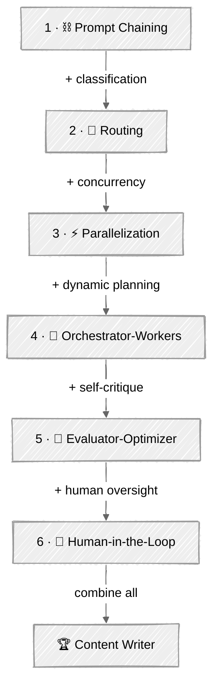

# Effective Agents Patterns

Architectural patterns that separate toy demos from real agents. Based on Anthropic's [Building Effective Agents](https://www.anthropic.com/research/building-effective-agents) — learn when to chain, route, parallelize, or delegate.

## 🗺️ Progression Path

| Step | Tutorial | What It Adds |
|:----:|----------|-------------|
| 1 | [Prompt Chaining](01-prompt-chaining/) | Sequential multi-step pipelines |
| 2 | [Routing](02-routing/) | + input classification |
| 3 | [Parallelization](03-parallelization/) | + concurrent execution |
| 4 | [Orchestrator-Workers](04-orchestrator-workers/) | + dynamic decomposition |
| 5 | [Evaluator-Optimizer](05-evaluator-optimizer/) | + self-critique |
| 6 | [Human in the Loop](06-human-in-the-loop/) | + human oversight |
| 🏆 | [Content Writer](07-content-writer/) | Combines all patterns |

## 💡 Tips for Success

1. Start simple — prompt chaining solves more problems than you'd expect
2. Each pattern adds complexity. Only reach for orchestration when chaining isn't enough
3. Run every script and experiment with different inputs before moving on
4. The blog/content domain is consistent across tutorials so you can see how patterns compose

## 📚 Tutorials

### [01 - Prompt Chaining](01-prompt-chaining/)

Break complex tasks into sequential steps where each LLM call builds on the previous output. Simple, debuggable, and surprisingly powerful.

**What you'll learn:** Sequential LLM pipelines, quality gates between steps, the Outliner → Writer → Editor pattern.

**Evolution:** Adds *sequential steps* — instead of one LLM call, chain multiple calls where each output feeds the next.

---

### [02 - Routing](02-routing/)

Classify incoming requests and dispatch them to specialized handlers. One agent decides, others execute — the foundation of scalable systems.

**What you'll learn:** LLM-powered classification with structured output, specialized chains per content type, why wrong routing = wrong output.

**Evolution:** Adds *input classification* — instead of one chain for everything, route to the right chain based on the input.

---

### [03 - Parallelization](03-parallelization/)

Fan-out work across multiple LLM calls simultaneously, then aggregate results. Trade latency for throughput when tasks are independent.

**What you'll learn:** ThreadPoolExecutor fan-out, the voting pattern (generate candidates → evaluate → pick best), result aggregation.

**Evolution:** Adds *concurrent execution* — instead of sequential processing, run independent tasks in parallel.

---

### [04 - Orchestrator-Workers](04-orchestrator-workers/)

A central agent dynamically breaks down tasks and delegates to specialized workers. The pattern behind most "AI agent" products you see today.

**What you'll learn:** Dynamic task decomposition via LLM, worker delegation, parallel research, synthesis of independent results.

**Evolution:** Adds *dynamic decomposition* — instead of you defining what to parallelize, the LLM decides.

---

### [05 - Evaluator-Optimizer](05-evaluator-optimizer/)

One LLM generates, another critiques, and the cycle repeats until quality thresholds are met. Self-improving output without human intervention.

**What you'll learn:** Separate generator/evaluator roles, structured scoring, feedback loops with convergence criteria.

**Evolution:** Adds *self-critique* — instead of single-pass generation, iterate until quality is sufficient.

---

### [06 - Human in the Loop](06-human-in-the-loop/)

Build approval gates, escalation paths, and feedback mechanisms. Every production agent needs a strategy for when to ask a human.

**What you'll learn:** Strategic checkpoint placement, approval/reject/edit patterns, the leverage principle (early checkpoints matter most).

**Evolution:** Adds *human oversight* — instead of fully autonomous operation, pause at critical decision points.

---

### 🏆 [07 - Content Writer](07-content-writer/)

A production-ready content creation pipeline that composes **all six patterns** from this module into one agent with social media parallelization, SEO title voting, Pydantic data models, and a typed async event system.

**What you'll learn:** Pattern composition (routing + chaining + parallelization + orchestration + evaluation + human oversight), Pydantic models for validated structured output, async generators for UI/agent separation.

**Evolution:** Combines *all patterns* — routing, chaining, parallelization, orchestration, evaluation, and human oversight — into a single production pipeline.

---

## 🔗 Resources

- [Building Effective Agents — Anthropic](https://www.anthropic.com/research/building-effective-agents)
- [OpenAI Agent Patterns](https://platform.openai.com/docs/guides/agents)
- [Agentic Design Patterns — Andrew Ng](https://www.deeplearning.ai/the-batch/how-agents-can-improve-llm-performance/)
