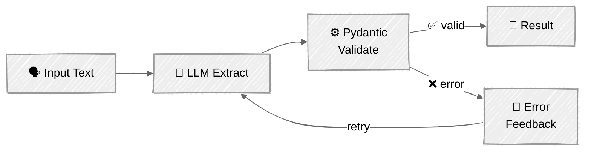

<!-- ---
title: "Structured Output & Validation"
description: "Production-grade techniques for extracting reliable, typed data from LLMs"
icon: "code"
--- -->

# Structured Output & Validation

Get validated, typed, production-safe data from LLMs — and handle when it breaks. Four techniques progressing from basic to bulletproof, using a real-world support ticket analysis domain.

> **Builds on:** [02-Prompt Engineering](../../01-foundations/02-prompt-engineering/) covered basic JSON extraction (prompt-based, XML prefill, native schema). This tutorial goes deeper — Pydantic integration, complex nested schemas, validation retry loops, and batch extraction.

## 🎯 What You'll Learn

- Extract structured data using **tool_use as structured output** — simple and complex schemas (the established pattern)
- Use **native constrained decoding** for guaranteed-valid JSON (Anthropic `output_config`)
- Build **self-healing extraction** with validation + retry error feedback loops
- Process **multiple items in batch** with a single API call
- Compare **Anthropic vs OpenAI** approaches — fundamentally different mechanisms, same goal

## 📦 Available Examples

| Provider | Script | Description |
|----------|--------|-------------|
|  | [01_structured_output_anthropic.py](01_structured_output_anthropic.py) | 4 techniques: tool_use, native schema, validation+retry, batch |
|  | [02_structured_output_openai.py](02_structured_output_openai.py) | OpenAI comparison: `text.format` with strict schema (simple + complex) |

## 🚀 Quick Start

> **Prerequisites:** Complete [SETUP.md](../../SETUP.md) first for API keys and environment.

```bash
# Anthropic (primary — 4 techniques)
uv run --directory 03-advanced-techniques/01-structured-output 01_structured_output_anthropic.py

# OpenAI (comparison — different mechanism)
uv run --directory 03-advanced-techniques/01-structured-output 02_structured_output_openai.py
```

Both scripts use an interactive menu — select a technique to see it in action.

## 🔑 Key Concepts

### The Problem: From Text to Types

LLMs produce text. Your application needs typed data — enums, nested objects, validated fields. The gap between "generates JSON-ish text" and "returns a validated `TicketAnalysis` object" is where structured output techniques live.

### Technique 1: Tool Use as Structured Output

The most widely-used pattern in production. Define a "tool" whose `input_schema` is your desired output schema, then force the model to call it. Works with both simple flat schemas and complex nested structures:

```python
# Use model.model_json_schema() to generate schemas — never hand-write them
tool = {
    "name": "classify_ticket",
    "description": "Classify a support ticket.",
    "input_schema": TicketClassification.model_json_schema(),
}
response = client.messages.create(
    tools=[tool],
    tool_choice={"type": "tool", "name": "classify_ticket"},  # Force this tool
    messages=[...],
)
# The tool's input IS your structured output
result = TicketClassification(**block.input)
```

The same pattern scales to complex nested schemas — Pydantic handles nesting, enums, and optionals:

```python
class TicketAnalysis(BaseModel):
    classification: TicketClassification    # Nested model
    entities: list[Entity]                  # List of objects
    action_items: list[ActionItem]          # Another list
    requires_escalation: bool
    escalation_reason: str | None = None    # Optional field

# One line generates the full JSON Schema
tool = {
    "name": "analyze_ticket",
    "input_schema": TicketAnalysis.model_json_schema(),
}
```

**When to use:** Works on all model versions, widely supported, battle-tested in production.

### Technique 2: Native Structured Output (Constrained Decoding)

Anthropic's native approach — the model literally cannot produce invalid JSON:

```python
response = client.beta.messages.parse(
    output_config={"format": TicketClassification},  # Pydantic model
    messages=[...],
)
result = response.parsed_output  # Already a validated Pydantic instance
```

**When to use:** When you need guaranteed validity with zero retries. The most reliable option available.

### Technique 3: Validation + Retry (Self-Healing)

For business rules that JSON Schema can't express — validate with Pydantic, feed errors back to the LLM:

```python
class TicketAnalysis(BaseModel):
    requires_escalation: bool
    escalation_reason: str | None = None

    @model_validator(mode="after")
    def check_escalation(self) -> "TicketAnalysis":
        if self.requires_escalation and not self.escalation_reason:
            raise ValueError("escalation_reason required when escalation is True")
        return self
```

The retry loop: extract → validate → on error, send validation message back → retry.



### Technique 4: Batch Extraction

Process multiple items in a single call — common in data pipelines:

```python
class TicketBatch(BaseModel):
    analyses: list[TicketAnalysis]
    batch_summary: str
    priority_distribution: dict[str, int]
```

**Trade-off:** Single call is cheaper but less reliable for large batches. Works well for 3-10 items; beyond that, parallelize individual calls.

### Anthropic vs OpenAI: Same Goal, Different API Surface

| Aspect | Anthropic | OpenAI |
|--------|-----------|--------|
| **Constrained decoding** | `output_config={"format": Model}` | `text.format` with strict schema |
| **Tool-based extraction** | `tool_use` + `tool_choice` | Also supported |
| **Pydantic integration** | Pass model directly | Need schema conversion helper |
| **Strict mode requirement** | None | `additionalProperties: false` everywhere |
| **Reliability** | Guaranteed (both approaches) | Guaranteed (strict mode) |

Both use constrained decoding to guarantee valid JSON — the API surface is the difference, not the mechanism or reliability.

## ⚠️ Important Considerations

- **Schema design matters:** Flat schemas are more reliable than deeply nested ones. Use enums over free-text for classification fields. Keep descriptions concise.
- **Optional fields need defaults:** Always set `= None` for optional fields. Models handle explicit defaults better than implicit ones.
- **Validation beyond schema:** JSON Schema validates structure. Pydantic `@model_validator` validates business rules. Use both.
- **Cost awareness:** Native schema and tool_use add minimal overhead. Validation retries multiply your token cost — cap retries at 2-3.
- **Batch limits:** Single-call batch extraction works well for 3-10 items. Beyond that, parallel individual calls are more reliable.

## 👉 Next Steps

- **[02 - Streaming](../02-streaming/)** — Add real-time token-by-token output to your agents
- **Experiment:** Try modifying the `TicketAnalysis` schema — add new fields, change enums, add more `@model_validator` rules
- **Challenge:** Build a multi-step pipeline that classifies a ticket (technique 1 with simple schema), then extracts full analysis only for high-priority tickets (technique 1 with complex schema)
