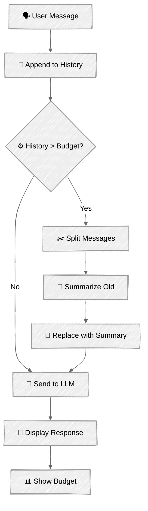

<!-- ---
title: "Context Engineering"
description: "Manage finite context windows with token counting, budget allocation, and automatic compression"
icon: "layers"
--- -->

# Context Engineering

Every conversation has a limit. The [chat tutorial](../../01-foundations/03-chat/) taught the basic pattern — append messages and send them all. That works until you hit the context window. This tutorial adds the engineering: measure tokens, allocate a budget, and automatically compress when you're running out of room.

The key insight: context engineering isn't about cramming more in — it's about deciding what matters most and keeping that.

## 🎯 What You'll Learn

- Count tokens precisely using `client.messages.count_tokens()` before sending requests
- Allocate a context budget across system prompt, conversation history, and response reserve
- Implement sliding window + summarization to compress older messages automatically
- Visualize context usage in real-time with a budget display
- Understand the trade-offs between different compression strategies

## 📦 Available Examples

| Provider                                        | File                                                                       | Description                                               |
| ----------------------------------------------- | -------------------------------------------------------------------------- | --------------------------------------------------------- |
|  | [01_context_engineering_anthropic.py](01_context_engineering_anthropic.py) | Interactive chat with budget management                   |
|  | [02_tool_context_anthropic.py](02_tool_context_anthropic.py)               | Tool output context strategies (naive/truncate/summarize) |

## 🚀 Quick Start

> **Prerequisites:** Python 3.11+, API keys, and uv. See [SETUP.md](../../SETUP.md) for full setup instructions.

```bash
uv run --directory 03-advanced-techniques/03-context-engineering python 01_context_engineering_anthropic.py
```

Or use the [Code Runner](https://marketplace.visualstudio.com/items?itemName=formulahendry.code-runner) VS Code extension to run the currently open script with a single click.

The demo uses an artificially low context budget (~2,000 tokens for history) so you'll see compression trigger after just a few exchanges. Chat about any topic — the budget display updates after each turn.

## 🔑 Key Concepts

### 1. Token Counting

Before you can manage a budget, you need to measure. Anthropic provides an exact token counting API:

```python
result = client.messages.count_tokens(
    model="claude-sonnet-4-6",
    system="You are a research assistant.",
    messages=messages,
)
print(result.input_tokens)  # exact token count for this request
```

This counts tokens the same way the API would — including any overhead from message formatting. Use it for pre-flight checks before sending requests.

### 2. Budget Allocation

A context window isn't a single pool — it's divided into competing components:

```
┌─────────────────────────────────────────────────────────┐
│                    Context Window                        │
│                                                         │
│  ┌──────────┐  ┌─────────────────────┐  ┌───────────┐  │
│  │  System   │  │  Conversation       │  │  Response  │  │
│  │  Prompt   │  │  History            │  │  Reserve   │  │
│  │  (fixed)  │  │  (flexible)         │  │  (fixed)   │  │
│  └──────────┘  └─────────────────────┘  └───────────┘  │
│                                                         │
│  Measured once    ← what you manage →    = max_tokens   │
└─────────────────────────────────────────────────────────┘
```

```python
@dataclass
class ContextBudget:
    max_context: int          # total window size
    system_tokens: int = 0    # measured at init
    response_reserve: int = 2048  # max_tokens for response

    @property
    def history_budget(self) -> int:
        return self.max_context - self.system_tokens - self.response_reserve
```

The system prompt is fixed — measure it once at startup. The response reserve is your `max_tokens` parameter. Everything left is your history budget.

### 3. Compression Strategy: Sliding Window + Summarization

When history exceeds the budget, compress:

```
Before compression (over budget):
┌────────────────────────────────────────┐
│ msg1  msg2  msg3  msg4  msg5  msg6  msg7 │  ← 5000 tokens
└────────────────────────────────────────┘

Split into old + recent:
┌─────────────────────┐ ┌───────────────┐
│ msg1  msg2  msg3     │ │ msg6  msg7     │  ← keep recent verbatim
└─────────────────────┘ └───────────────┘
         │
         ▼ LLM summarize
┌─────────────┐
│   summary    │  ← compressed to ~200 tokens
└─────────────┘

After compression (within budget):
┌─────────────┐ ┌───────────────┐
│   summary    │ │ msg6  msg7     │  ← 1500 tokens
└─────────────┘ └───────────────┘
```

The summary preserves key facts and decisions. Recent messages stay verbatim so the model has full fidelity on the latest context.

### 4. Compression Flow

<!-- prettier-ignore -->


### 5. Why Summarize Instead of Drop?

| Strategy        | Pros                | Cons                            |
| --------------- | ------------------- | ------------------------------- |
| **Drop oldest** | Simple, predictable | Loses context permanently       |
| **Truncate**    | No API call needed  | Cuts mid-thought, loses meaning |
| **Summarize**   | Preserves key facts | Costs an extra API call         |

Summarization is the best default — the model retains awareness of earlier topics while using a fraction of the tokens. The cost is one extra API call per compression, which is usually worthwhile for maintaining conversation quality.

### 6. Context Window Sizes

For reference, here are context windows across Claude models:

| Model             | Context Window | Notes                         |
| ----------------- | -------------- | ----------------------------- |
| Claude Opus 4     | 200K tokens    | Most capable, largest context |
| Claude Sonnet 4.5 | 200K tokens    | Balanced performance and cost |
| Claude Haiku 3.5  | 200K tokens    | Fastest, most cost-effective  |

In production, you'd set your budget close to the actual model limit. This tutorial uses 4K to make compression visible quickly.

### 7. Tool Output Strategies

In agent systems, tool outputs are the biggest context consumers — a single CRM lookup or product search can return 1000+ tokens of JSON. Script 02 demonstrates three strategies for managing this:

```
Raw tool output (~1500 tokens):
┌──────────────────────────────────┐
│ { "orders": [ { "id": "ORD-9001", │
│   "items": [ ... ], "total": ... │
│   }, { "id": "ORD-8744", ...     │
│   }, ... 6 more orders ...       │
│ ] }                              │
└──────────────────────────────────┘
   │               │               │
   ▼               ▼               ▼
 Naive          Truncate       Summarize
 (as-is)       (cap chars)    (LLM extract)
 1500 tok       ~150 tok       ~200 tok
```

| Strategy      | How it works                              | Cost                            | Risk                                       |
| ------------- | ----------------------------------------- | ------------------------------- | ------------------------------------------ |
| **Naive**     | Inject raw JSON directly                  | Zero                            | Fills context in 2-3 calls                 |
| **Truncate**  | Cap at N characters, append `[TRUNCATED]` | Zero                            | Loses data from the end — may cut key info |
| **Summarize** | LLM extracts key facts into bullet points | One extra API call per tool use | Costs tokens but preserves meaning         |

```python
def _process_tool_result(self, tool_name: str, raw_result: str) -> str:
    """Apply selected strategy to tool output before injecting into context."""
    if self.strategy == "naive":
        return raw_result
    if self.strategy == "truncate":
        return self._truncate_result(raw_result)
    if self.strategy == "summarize":
        return self._summarize_result(tool_name, raw_result)
```

The summarize strategy uses a focused system prompt to extract only the relevant facts:

```python
def _summarize_result(self, tool_name: str, result: str) -> str:
    response = self.client.messages.create(
        model=self.model,
        max_tokens=512,
        system="Extract the key facts from this tool output into a concise summary. "
               "Preserve all names, IDs, numbers, dates, and statuses.",
        messages=[{"role": "user", "content": f"Tool: {tool_name}\n\nOutput:\n{result}"}],
    )
    return response.content[0].text
```

## 🏗️ Code Structure

### Script 01 — Chat Context (ContextManager)

```python
class ContextManager:
    """Manages context window allocation and conversation compression."""

    def chat(self, user_input: str) -> str:
        """Append message → compress if needed → send → return response."""

    def _count_tokens(self, messages: list[dict]) -> int:
        """Pre-flight token measurement via count_tokens API."""

    def _compress_if_needed(self) -> None:
        """Split old/recent → summarize old → replace."""

    def _summarize_messages(self, messages: list[dict]) -> str:
        """LLM-powered summarization of message blocks."""

    def get_token_snapshot(self) -> TokenSnapshot:
        """Current budget state for visualization."""
```

### Script 02 — Tool Output Context (ToolContextAgent)

```python
class ToolContextAgent:
    """Agent demonstrating tool output context management strategies."""

    def chat(self, user_input: str) -> str:
        """Agent loop: send → detect tool calls → execute → process results → loop."""

    def _process_tool_result(self, tool_name: str, raw_result: str) -> str:
        """Apply selected strategy to tool output before injecting into context."""

    def _truncate_result(self, result: str) -> str:
        """Cap at TRUNCATE_MAX_CHARS with truncation indicator."""

    def _summarize_result(self, tool_name: str, result: str) -> str:
        """LLM call to extract key facts from tool output."""

    def _count_tokens(self, messages: list[dict]) -> int:
        """Pre-flight token measurement via count_tokens API."""

    def _compress_if_needed(self) -> None:
        """Split old/recent → summarize old → replace."""

    def get_token_snapshot(self) -> TokenSnapshot:
        """Budget state for visualization."""
```

## ⚠️ Important Considerations

- **Token counting costs** — `count_tokens()` is a lightweight API call but still has latency. In production, consider caching counts or estimating with tiktoken for non-critical checks.
- **Summary quality** — summarization is lossy by design. Fine details may be lost. For conversations where every detail matters, consider larger context windows or external memory instead.
- **Alternating message roles** — the Anthropic API requires alternating user/assistant messages. After inserting a summary (as a user message), you may need an assistant acknowledgment before the next user message.
- **Compression cascading** — if summaries themselves grow large over many compressions, you may need to re-summarize. This implementation handles this naturally since it checks the budget on every turn.
- **Artificial budget** — the 8K budget in this demo is intentionally small. Production systems with Claude's 200K context window will compress far less frequently.

## 👉 Next Steps

Once you've mastered context engineering, continue to:
- **[Cost Optimization](../04-cost-optimization/)** — Reduce API costs with prompt caching and intelligent model routing
- **Experiment** — Try changing `RECENT_MESSAGES_TO_KEEP` and `MAX_CONTEXT_TOKENS` to see how they affect compression behavior
- **Explore** — Add a "recall" command that shows the current summary, or try different summarization prompts
