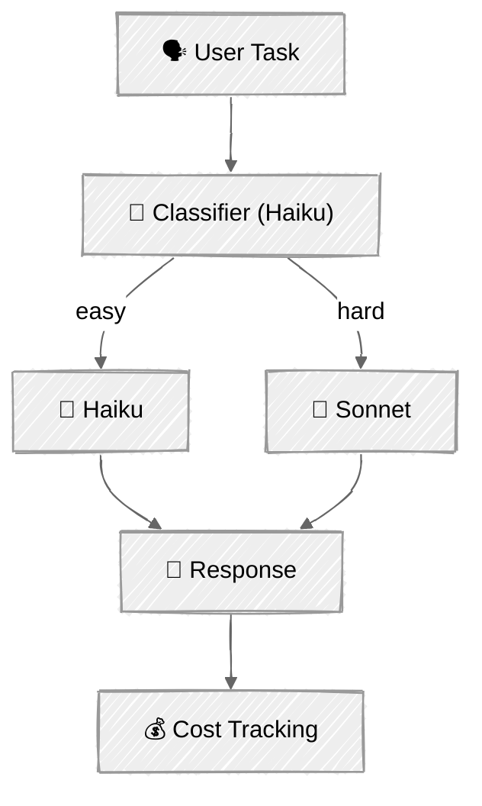

<!-- ---
title: "Cost Optimization"
description: "Reduce API costs with prompt caching and intelligent model routing"
icon: "zap"
--- -->

# Cost Optimization

The [context engineering tutorial](../03-context-engineering/) taught you to manage *what* fits in the context window. This tutorial tackles a different problem: reducing the *cost* of what you send. Two complementary strategies — cache repeated content so you pay less for it, and route tasks to the cheapest model that can handle them.

## 🎯 What You'll Learn

- Structure system prompts with explicit cache breakpoints for Anthropic's prompt caching
- Understand cache MISS vs HIT mechanics and the 5-minute TTL
- Track cache metrics and calculate real cost savings analytically
- Build a model router that classifies task difficulty with a cheap model
- Route tasks to Haiku (easy) or Sonnet (hard) based on complexity
- Compare routed costs against an all-Sonnet baseline

## 📦 Available Examples

| Provider                                        | File                                                                             | Description                                       |
| ----------------------------------------------- | -------------------------------------------------------------------------------- | ------------------------------------------------- |
|  | [01_prompt_caching_anthropic.py](01_prompt_caching_anthropic.py)                 | Customer support agent with cached policy document |
|  | [02_model_routing_anthropic.py](02_model_routing_anthropic.py)                   | Difficulty-based routing (Haiku vs Sonnet)         |

## 🚀 Quick Start

> **Prerequisites:** Python 3.11+, API keys, and uv. See [SETUP.md](../../SETUP.md) for full setup instructions.

```bash
# Prompt caching demo
uv run --directory 03-advanced-techniques/04-cost-optimization python 01_prompt_caching_anthropic.py

# Model routing demo
uv run --directory 03-advanced-techniques/04-cost-optimization python 02_model_routing_anthropic.py
```

Or use the [Code Runner](https://marketplace.visualstudio.com/items?itemName=formulahendry.code-runner) VS Code extension to run the currently open script with a single click.

## 🔑 Key Concepts

### 1. How Prompt Caching Works

Anthropic caches the *prefix* of your prompt. The first call writes to cache (small premium); subsequent calls with the same prefix read from cache at 90% savings.

```
Call 1 — Cache MISS:
┌──────────────────────────────────┐
│  System: instructions + policy   │ ──→ written to cache (1.25x cost)
│  User: "What's the return policy?"│
└──────────────────────────────────┘

Call 2 — Cache HIT:
┌──────────────────────────────────┐
│  System: instructions + policy   │ ──→ read from cache (0.1x cost!)
│  User: "How long is shipping?"   │
└──────────────────────────────────┘
```

The cache has a 5-minute TTL, refreshed on each hit. As long as you keep making requests, the cache stays warm.

### 2. Cache-Aware Prompt Design

Structure your system prompt for maximum cache reuse:

| Rule | Why |
| --- | --- |
| **Static content first** | Cache is prefix-based — put stable content (policies, instructions) at the beginning |
| **Dynamic content last** | Anything after the cached prefix is charged at full rate |
| **Exceed minimum tokens** | Sonnet requires 1024+ tokens in the cached block; Haiku requires 2048+ |
| **Use explicit breakpoints** | `cache_control: {"type": "ephemeral"}` gives precise control over what's cached |
| **Mind the TTL** | 5-minute window — caching only helps if requests come frequently enough |

```python
# Explicit cache breakpoints on system prompt blocks
system = [
    {"type": "text", "text": "Short instructions..."},
    {
        "type": "text",
        "text": large_policy_document,   # 1500+ tokens
        "cache_control": {"type": "ephemeral"},
    },
]
```

### 3. Reading Cache Metrics

Every Anthropic response includes cache token counts in the `usage` object:

```python
response = client.messages.create(model=model, system=system, messages=messages)

usage = response.usage
print(usage.input_tokens)                  # total input tokens
print(usage.cache_creation_input_tokens)   # tokens written to cache (MISS)
print(usage.cache_read_input_tokens)       # tokens read from cache (HIT)
```

On the first call, `cache_creation_input_tokens > 0`. On subsequent calls with the same prefix, `cache_read_input_tokens > 0` — that's your 90% savings.

### 4. When Caching Hurts

| Anti-pattern | Problem |
| --- | --- |
| Unique prompts every call | You pay the 1.25x write premium but never get a cache hit |
| System prompt < 1024 tokens | Below the minimum — Sonnet won't cache it at all |
| Requests spaced > 5 minutes apart | Cache expires between calls, so every call is a write |
| Dynamic content before static | Breaks the prefix — cache can't match after the dynamic part |

### 5. Model Routing

Not every task needs your most capable (and expensive) model. A routing layer classifies each task and sends it to the right model:

<!-- prettier-ignore -->


The classifier itself runs on Haiku (cheap), adding minimal overhead. Even with the classification cost, routing simple tasks to Haiku saves significantly vs sending everything to Sonnet.

### 6. Cost Comparison

| Model | Input ($/MTok) | Output ($/MTok) | Best for |
| --- | --- | --- | --- |
| Haiku 4.5 | $1.00 | $5.00 | Factual lookups, simple math, classification |
| Sonnet 4.5 | $3.00 | $15.00 | Analysis, design, multi-step reasoning |

Haiku input costs **67% less** than Sonnet. For workloads where 50%+ of tasks are simple, routing can cut costs substantially.

## 🏗️ Code Structure

### Script 01 — Prompt Caching (CachedSupportAgent)

```python
class CachedSupportAgent:
    """Customer support agent demonstrating prompt caching."""

    def _build_system(self) -> str | list[dict]:
        """Build system prompt with cache_control blocks or plain string."""

    def chat(self, user_input: str) -> tuple[str, dict]:
        """Send message, track cache metrics, return (response, usage_dict)."""

@dataclass
class CacheMetrics:
    """Tracks cache performance across API calls."""

    def record_call(...) -> None: ...
    def cost_with_caching(self) -> float: ...
    def cost_without_caching(self) -> float: ...     # all tokens at base input rate
    def savings(self) -> float: ...
    def cache_hit_rate(self) -> float: ...
```

### Script 02 — Model Routing (ModelRouter)

```python
class ModelRouter:
    """Routes tasks to appropriate models based on complexity."""

    def classify(self, task: str) -> str:
        """Haiku classifies as 'easy' or 'hard'."""

    def execute(self, task: str, model: str) -> tuple[str, int, int]:
        """Run task on specified model."""

    def route_and_execute(self, task: str) -> TaskResult:
        """Classify → route → execute → track costs."""

    def get_summary(self) -> dict:
        """Aggregate: total routed cost, baseline cost, savings."""
```

## ⚠️ Important Considerations

- **Cache TTL** — Anthropic's prompt cache has a 5-minute TTL. Caching only helps if you make multiple requests within that window. Each cache hit refreshes the timer.
- **Write premium** — The first call pays 1.25x for cached tokens. You need at least 4 cache hits to break even on the write cost (since reads are 0.1x).
- **Cannot "un-cache"** — Once cached server-side, you can't force a cache miss. The scripts calculate "cost without caching" analytically by treating all tokens at the base input rate.
- **Routing accuracy** — The classifier isn't perfect. Occasional misroutes (hard task → Haiku) may produce lower-quality responses. In production, add confidence thresholds or fallback logic.
- **Pricing changes** — Token prices are hardcoded as constants. Check Anthropic's pricing page for current rates.
- **Minimum token thresholds** — Cache breakpoints require minimum token counts (1024 for Sonnet, 2048 for Haiku). Below the threshold, caching is silently skipped.

## 👉 Next Steps

Once you've explored cost optimization, continue to:
- **[Memory Systems](../05-memory/)** — Give agents persistent memory across sessions
- **Experiment** — Try combining both strategies: cache the system prompt *and* route tasks to different models
- **Explore** — Add a third routing tier (e.g., Opus for the hardest tasks) or implement confidence-based fallback
