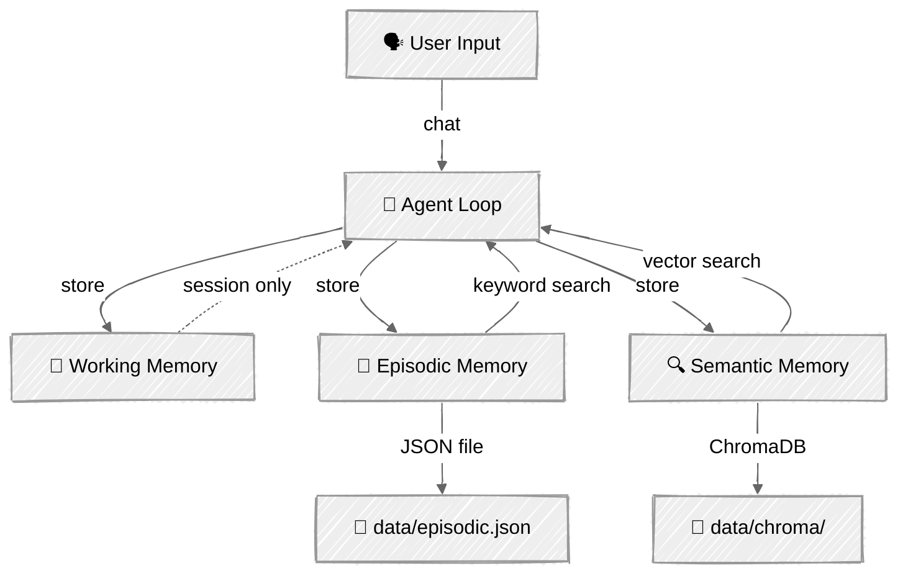

<!-- ---
title: "Memory Systems"
description: "Give agents persistent memory — working buffers, episodic events, and semantic knowledge across sessions"
icon: "database"
--- -->

# Memory Systems

Give your agents memory that persists across sessions. This tutorial builds on [Context Engineering](../03-context-engineering/) (managing a single session's context window) and adds **persistence** — so your agent remembers who you are, what you've told it, and what happened in previous conversations.

You'll implement a three-tier memory architecture inspired by human cognition: working memory (short-term buffer), episodic memory (timestamped events), and semantic memory (facts and knowledge in a vector database).

## 🎯 What You'll Learn

- Distinguish between working, episodic, and semantic memory tiers
- Build an importance-based eviction buffer for session state
- Persist timestamped events to a JSON file with keyword search
- Store and retrieve facts using ChromaDB's built-in embeddings and cosine similarity
- Orchestrate cross-tier memory search with ranked results
- Inject recalled memories into system prompts for context-aware responses
- Consolidate conversations into long-term memory using LLM extraction

## 📦 Available Examples

| Provider                                        | File                                                                           | Description                               |
| ----------------------------------------------- | ------------------------------------------------------------------------------ | ----------------------------------------- |
|  | [01_memory_agent_anthropic.py](01_memory_agent_anthropic.py)                   | Personal assistant with tiered memory     |
|  | [02_memory_inspector_anthropic.py](02_memory_inspector_anthropic.py)           | Memory browser/inspector (no LLM calls)   |

## 🚀 Quick Start

> **Prerequisites:** Python 3.11+, API keys, and uv. See [SETUP.md](../../SETUP.md) for full setup instructions.

```bash
# Memory agent — chat and build persistent memory
uv run --directory 03-advanced-techniques/05-memory python 01_memory_agent_anthropic.py

# Memory inspector — browse and manage stored memories
uv run --directory 03-advanced-techniques/05-memory python 02_memory_inspector_anthropic.py
```

Or use the [Code Runner](https://marketplace.visualstudio.com/items?itemName=formulahendry.code-runner) VS Code extension to run the currently open script with a single click.

## 🔑 Key Concepts

### 1. Three-Tier Memory Architecture

Agents need different kinds of memory for different purposes — just like humans distinguish between what they're currently thinking about, what happened recently, and what they know as facts.



| Tier | Purpose | Storage | Lifespan | Search |
|------|---------|---------|----------|--------|
| **Working** | Current session context | In-memory list | Session | Direct access |
| **Episodic** | Events and interactions | JSON file | Permanent | Keyword matching |
| **Semantic** | Facts and knowledge | ChromaDB vectors | Permanent | Cosine similarity |

### 2. Memory Lifecycle

Every memory flows through a predictable lifecycle:

**Capture** → The agent decides something is worth remembering (via tool call or consolidation)

**Store** → Routed to the appropriate tier based on content type

**Retrieve** → Cross-tier search combines keyword and vector results, ranked by `similarity × importance`

**Consolidate** → At session end, an LLM extracts important items from the conversation into persistent storage

**Forget** → Explicit deletion via tool call, or working memory eviction when the buffer is full

### 3. Episodic vs Semantic Memory

**Episodic memory** stores *what happened* — events with timestamps:

```python
# "The user told me their name is Alex" — an event that happened
episodic.save(MemoryEntry(
    content="User introduced themselves as Alex, works at Acme Corp",
    importance=0.8,
))

# Keyword search — find entries containing matching words
results = episodic.search("Alex")  # Returns matching MemoryEntry objects
```

**Semantic memory** stores *what is known* — facts and preferences:

```python
# "Alex prefers Python" — a fact, not an event
semantic.save(MemoryEntry(
    content="User prefers Python over JavaScript for backend development",
    importance=0.7,
))

# Vector search — finds semantically similar entries even with different words
results = semantic.search("programming language preferences")
# Returns [(MemoryEntry, similarity_score), ...]
```

### 4. Memory-Augmented Prompts

The key pattern: inject recalled memories into the system prompt so the LLM has context before the user even speaks.

```python
def _build_system_prompt(self) -> str:
    """Inject recalled memories into the system prompt."""
    memory_context = self.memory.build_memory_context()
    return SYSTEM_PROMPT.format(memory_context=memory_context)
```

The `build_memory_context()` method retrieves recent episodic events and top semantic facts, formatting them as markdown sections the LLM can reference naturally.

### 5. Agent-Driven Memory (Three Tools)

Rather than hardcoding when to save memories, give the agent **tools** and let it decide:

```python
MEMORY_TOOLS = [
    {"name": "remember", ...},  # Store in any tier with importance score
    {"name": "recall", ...},    # Cross-tier search by query
    {"name": "forget", ...},    # Delete by ID and tier
]
```

The agent learns when to use each tool through the system prompt instructions. It calls `remember` when the user shares important information, `recall` to check existing knowledge, and `forget` when asked to remove something.

### 6. Session Consolidation

At the end of each session, the agent reviews the conversation and extracts important items into persistent storage:

```python
saved = agent.memory.consolidate(agent.messages, agent.client, MODEL)
# LLM analyzes conversation → extracts facts/events → saves to episodic + semantic
```

This catches information the agent didn't explicitly `remember` during the conversation, ensuring nothing important is lost between sessions.

## 🏗️ Code Structure

```
05-memory/
├── memory/
│   ├── __init__.py       # Package exports
│   ├── models.py         # MemoryEntry dataclass, MemoryType enum
│   ├── working.py        # WorkingMemory — session buffer with eviction
│   ├── episodic.py       # EpisodicMemory — JSON-backed event store
│   ├── semantic.py       # SemanticMemory — ChromaDB vector store
│   └── manager.py        # MemoryManager — orchestrates all tiers
├── 01_memory_agent_anthropic.py    # Personal assistant with memory tools
└── 02_memory_inspector_anthropic.py # Memory browser (no LLM)
```

| Class | Key Methods |
|-------|-------------|
| `WorkingMemory` | `add()`, `get_recent()`, `get_important()`, `clear()` |
| `EpisodicMemory` | `save()`, `search()`, `get_recent()`, `delete()` |
| `SemanticMemory` | `save()`, `search()`, `delete()`, `list_all()` |
| `MemoryManager` | `remember()`, `recall()`, `forget()`, `build_memory_context()`, `consolidate()` |
| `MemoryAgent` | `chat()`, `_build_system_prompt()`, `_execute_tool()` |

## ⚠️ Important Considerations

- **ChromaDB first-run download** — ChromaDB downloads a small embedding model (~80MB) on first use. Subsequent runs use the cached model.
- **Unbounded growth** — Episodic and semantic memories grow without limit. For production, add retention policies or size caps.
- **Consolidation cost** — The `consolidate()` call at session end makes one additional LLM API call. Skip it for very short sessions.
- **Embedding quality** — ChromaDB's default embeddings work well for short facts. For longer documents or higher accuracy, consider a dedicated embedding model.
- **No encryption** — Memories are stored in plaintext JSON and ChromaDB files. Do not store sensitive information (passwords, tokens) in agent memory.

## 👉 Next Steps

- **[RAG Techniques](../06-rag-techniques/)** — Build retrieval-augmented generation pipelines with hybrid search and agentic retrieval
- **Experiments to try:**
  - Add a retention policy that auto-deletes episodic memories older than 30 days
  - Implement memory summarization — compress old episodic entries into semantic facts
  - Add a fourth tier: procedural memory for learned workflows and routines
  - Build a multi-user memory system with separate stores per user ID
