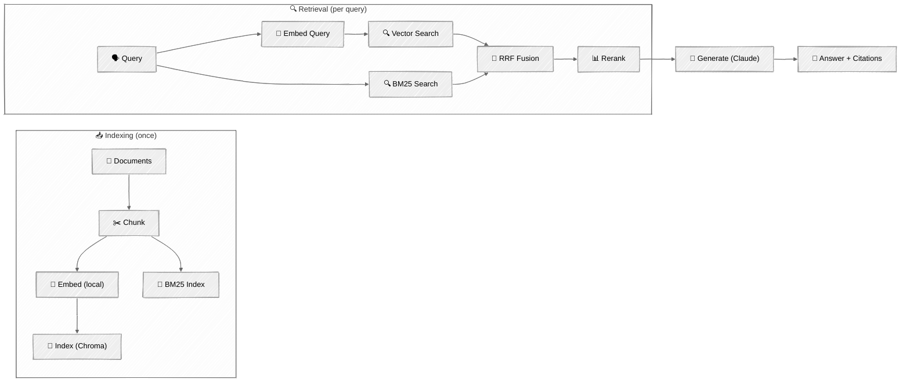
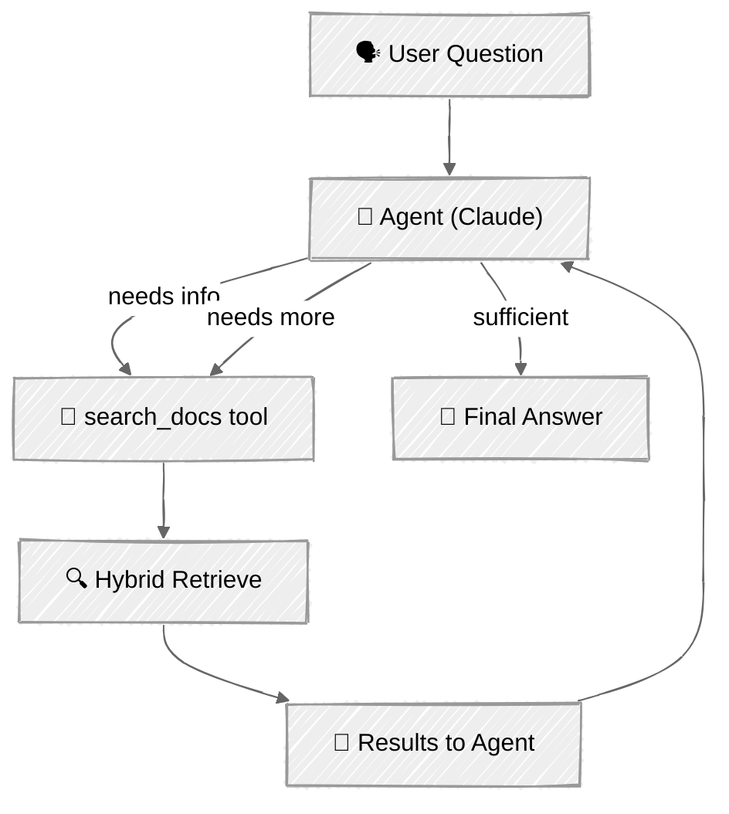

<!-- ---
title: "RAG Techniques"
description: "Build retrieval-augmented generation pipelines with hybrid search, reranking, and agentic retrieval"
icon: "search"
--- -->

# RAG Techniques

Most AI agents need to answer questions about information the model wasn't trained on — company docs, product manuals, codebases. RAG (Retrieval-Augmented Generation) bridges that gap: retrieve relevant context from a knowledge base and feed it to the model alongside the question.

But naive RAG (embed everything, retrieve top-5, hope for the best) has well-documented failure modes. This tutorial teaches the engineering that makes RAG actually work: hybrid search, reranking, and agentic retrieval where the agent decides when and what to search.

## 🎯 What You'll Learn

- Build a complete RAG pipeline: ingest, chunk, embed, index, retrieve, generate
- Use local sentence-transformer embeddings (no API key needed)
- Combine BM25 keyword search with vector search using reciprocal rank fusion
- Rerank results with FlashRank for precision without API costs
- Build an agentic RAG system where the agent controls retrieval as a tool
- Understand when to use RAG vs. just putting everything in the context window

## 📦 Available Examples

| Provider                                        | File                                                                             | Description                                 |
| ----------------------------------------------- | -------------------------------------------------------------------------------- | ------------------------------------------- |
|  | [01_rag_pipeline_anthropic.py](01_rag_pipeline_anthropic.py)                     | Full RAG pipeline with hybrid search        |
|  | [02_agentic_rag_anthropic.py](02_agentic_rag_anthropic.py)                       | Agent-controlled retrieval with tool use    |

## 🚀 Quick Start

> **Prerequisites:** Python 3.11+, API keys, and uv. See [SETUP.md](../../SETUP.md) for full setup instructions.

This tutorial requires one API key:
- `ANTHROPIC_API_KEY` — for Claude (generation)

Embeddings run locally using `sentence-transformers` (all-MiniLM-L6-v2, ~80MB download on first run).

```bash
# RAG pipeline demo
uv run --directory 03-advanced-techniques/06-rag-techniques python 01_rag_pipeline_anthropic.py

# Agentic RAG demo
uv run --directory 03-advanced-techniques/06-rag-techniques python 02_agentic_rag_anthropic.py
```

Or use the [Code Runner](https://marketplace.visualstudio.com/items?itemName=formulahendry.code-runner) VS Code extension to run the currently open script with a single click.

The first run downloads the embedding model (~80MB) and reranking model (~4MB), then creates embeddings for the sample documents. Subsequent runs load from the persisted ChromaDB index.

## 🔑 Key Concepts

### 1. When to Use RAG

Not every application needs RAG. The decision depends on your knowledge base size and how often it changes:

| Scenario | Approach | Why |
| --- | --- | --- |
| Knowledge base < 200K tokens | Context stuffing | Just put it all in the prompt — simpler, more reliable |
| Static knowledge, many queries | RAG | Amortize embedding cost over many queries |
| Frequently updated knowledge | RAG | Re-index changed documents without retraining |
| Model needs to cite sources | RAG | Retrieved chunks provide natural source attribution |
| General knowledge questions | No RAG needed | The model already knows — don't retrieve what it has |

### 2. The RAG Pipeline

<!-- prettier-ignore -->


### 3. Chunking

Documents are split into chunks small enough to embed but large enough to preserve meaning. We use recursive splitting — it tries natural boundaries (paragraphs, then lines, then sentences) before falling back to character splits:

```python
chunks = recursive_split(
    text,
    source="api_reference.md",
    chunk_size=512,      # target size in characters
    chunk_overlap=64,    # overlap prevents losing context at boundaries
)
```

Why recursive splitting? It respects document structure. A paragraph break is a better split point than the middle of a sentence. The overlap ensures that information spanning two chunks isn't lost.

### 4. Embeddings

We use [sentence-transformers](https://www.sbert.net/) with the `all-MiniLM-L6-v2` model — a lightweight (~80MB) model that runs locally with no API key. It produces 384-dimensional embeddings suitable for semantic search:

```python
from sentence_transformers import SentenceTransformer

model = SentenceTransformer("all-MiniLM-L6-v2")

# Embed documents for indexing
doc_embeddings = model.encode(["document text here", ...])

# Embed a query for search
query_embedding = model.encode("search query")
```

For production workloads with higher accuracy requirements, consider API-based embedding providers like Voyage AI or OpenAI embeddings — they offer larger models with document/query distinction that can improve retrieval quality.

### 5. Why Hybrid Search

Vector search finds semantically similar content but can miss exact matches. BM25 keyword search finds exact terms but misses paraphrases. Combining both catches what either alone would miss:

```
Query: "What is the rate limit for the Pro plan?"

Vector search finds:
  ✓ "Rate limits are enforced per API key..."     (semantic match)
  ✗ Misses the exact "Pro plan" mention buried in a list

BM25 search finds:
  ✓ "Pro plan: 500 requests/minute, 50,000/day"   (exact keyword match)
  ✗ Misses semantically related rate limiting concepts

Hybrid (both + RRF fusion):
  ✓ Returns both — best of both worlds
```

**Reciprocal Rank Fusion (RRF)** merges the two ranked lists. Each item's score = `1/(k + rank)` summed across lists. Items appearing in both lists score higher. The constant `k=60` (from the original paper) dampens the effect of rank position.

### 6. Reranking

Retrieve many candidates (20+), then rerank to the top 5. The reranker (a cross-encoder model) scores each query-document pair directly, which is more accurate than vector similarity but too slow to run on the entire collection:

```
Before reranking (by RRF score):
  1. Generic rate limiting overview        ← relevant but not specific
  2. Pro plan: 500 req/min, 50,000/day     ← exactly what we want
  3. Authentication methods                ← not relevant
  4. Rate limit error handling (429)       ← partially relevant
  5. Enterprise plan details               ← wrong plan

After reranking (by cross-encoder relevance):
  1. Pro plan: 500 req/min, 50,000/day     ← promoted to top
  2. Rate limit error handling (429)       ← useful context
  3. Generic rate limiting overview        ← supporting info
```

We use [FlashRank](https://github.com/PrithivirajDamodaran/FlashRank) — a lightweight reranker (~4MB ONNX model) that runs on CPU with no API key needed.

### 7. Pipeline RAG vs. Agentic RAG

Script 01 is a **pipeline** — every question triggers the same retrieve → generate flow. Script 02 is an **agent** — the LLM decides whether and how to use retrieval:

| Aspect | Pipeline RAG | Agentic RAG |
| --- | --- | --- |
| Retrieval trigger | Every question | Agent decides |
| Search query | User's question directly | Agent formulates its own query |
| Multi-step retrieval | Not supported | Agent can search multiple times |
| Follow-up questions | Each is independent | Agent uses conversation context |
| Complexity | Simple, predictable | More flexible, less predictable |
| Best for | Single-turn Q&A, search interfaces | Conversational assistants, complex queries |

<!-- prettier-ignore -->


## 🏗️ Code Structure

### `rag/` Package

```python
# rag/chunker.py
def recursive_split(text, source, chunk_size=512, chunk_overlap=64) -> list[Chunk]: ...

# rag/embedder.py
class LocalEmbedder:
    def embed_documents(self, texts: list[str]) -> list[list[float]]: ...
    def embed_query(self, query: str) -> list[float]: ...

# rag/store.py
class VectorStore:
    def add_chunks(self, chunks: list[Chunk]) -> None: ...
    def vector_search(self, query: str, top_k: int) -> list[tuple[Chunk, float]]: ...
    def keyword_search(self, query: str, top_k: int) -> list[tuple[Chunk, float]]: ...

# rag/retriever.py
class HybridRetriever:
    def retrieve(self, query: str, top_k: int = 5) -> list[Chunk]: ...

# rag/reranker.py
class Reranker:
    def rerank(self, query: str, chunks: list[Chunk], top_k: int) -> list[Chunk]: ...
```

### Script 01 — Pipeline RAG (RAGPipeline)

```python
class RAGPipeline:
    def ingest(self, docs_dir: Path) -> int: ...
    def query(self, question: str) -> tuple[str, list[Chunk]]: ...
```

### Script 02 — Agentic RAG (AgenticRAG)

```python
class AgenticRAG:
    def chat(self, user_input: str, console: Console) -> str: ...
```

## ⚠️ Important Considerations

- **One API key required** — `ANTHROPIC_API_KEY` for Claude. Embeddings run locally with no API key.
- **First run setup** — The first run downloads the embedding model (~80MB) and FlashRank reranker (~4MB), then creates embeddings. Subsequent runs load from the persisted `.chroma_db/` directory. Delete `.chroma_db/` to force re-indexing.
- **Embedding quality > retrieval tricks** — Bad embeddings can't be rescued by better retrieval strategies. Start with a good embedding model before tuning retrieval.
- **Chunk size trade-offs** — Smaller chunks (256) give more precise retrieval but lose context. Larger chunks (1024) preserve context but reduce precision. 512 is a practical default.
- **Cost at scale** — Embedding costs are one-time (at indexing). Retrieval is free (local ChromaDB + BM25). Only the generation call costs money per query.
- **Production considerations** — This tutorial uses file-based ChromaDB. For production, consider managed vector databases (Pinecone, Weaviate) and hosted embedding APIs with batch pricing.

## 👉 Next Steps

Once you've built RAG pipelines, continue to:
- **[Multimodal](../07-multimodal/)** — Process images, generate visuals, and handle audio alongside text
- **Experiment** — Try different chunk sizes (256 vs 512 vs 1024) and compare retrieval quality
- **Explore** — Add your own documents to `sample_docs/` and see how the pipeline handles them
- **Advanced** — Read about [Anthropic's Contextual Retrieval](https://www.anthropic.com/news/contextual-retrieval) for a technique that enriches chunks with document-level context before embedding
