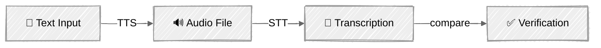

<!-- ---
title: "Multimodal Agents"
description: "Process images, generate visuals, and handle audio alongside text"
icon: "image"
--- -->

# Multimodal Agents

Move beyond text-only agents. This tutorial teaches three core multimodal skills — image understanding (vision), image generation, and audio (text-to-speech + speech-to-text) — each using the best provider for the job.

## 🎯 What You'll Learn

- Send images to Claude for visual analysis using URL and base64 sources
- Compare multiple images in a single request
- Detect MIME types and encode local files for the vision API
- Generate images from text prompts with Gemini's native image generation
- Use `response_modalities` to request mixed text+image output
- Convert text to speech with OpenAI's 6 voice options
- Transcribe audio files with Whisper
- Verify round-trip fidelity: text → speech → transcription → comparison

## 📦 Available Examples

| Provider                                        | File                                                           | Description                         |
| ----------------------------------------------- | -------------------------------------------------------------- | ----------------------------------- |
|  | [01_vision_anthropic.py](01_vision_anthropic.py)               | Image analysis with Claude vision   |
|        | [02_image_generation_gemini.py](02_image_generation_gemini.py) | Native image generation with Gemini |
|        | [03_audio_openai.py](03_audio_openai.py)                       | Text-to-speech and speech-to-text   |

## 🚀 Quick Start

> **Prerequisites:** Python 3.11+, API keys, and uv. See [SETUP.md](../../SETUP.md) for full setup instructions.

```bash
# Vision — analyze images with Claude
uv run --directory 03-advanced-techniques/07-multimodal python 01_vision_anthropic.py

# Image Generation — create images with Gemini
uv run --directory 03-advanced-techniques/07-multimodal python 02_image_generation_gemini.py

# Audio — text-to-speech and transcription with OpenAI
uv run --directory 03-advanced-techniques/07-multimodal python 03_audio_openai.py
```

Or use the [Code Runner](https://marketplace.visualstudio.com/items?itemName=formulahendry.code-runner) VS Code extension to run the currently open script with a single click.

## 🔑 Key Concepts

### 1. Image Input Formats

Claude accepts images in two formats — URL-referenced or base64-encoded:

```python
# URL source — Claude fetches the image directly
{"type": "image", "source": {"type": "url", "url": "https://example.com/photo.jpg"}}

# Base64 source — image data sent inline
{"type": "image", "source": {"type": "base64", "media_type": "image/jpeg", "data": "<base64>"}}
```

Supported formats: JPEG, PNG, GIF, WebP. Images are resized to fit within 1568×1568 px.

### 2. Vision API Pattern

Images are sent as content blocks alongside text in the messages array:

```python
response = client.messages.create(
    model="claude-sonnet-4-6",
    max_tokens=2048,
    messages=[{
        "role": "user",
        "content": [
            {"type": "image", "source": {"type": "url", "url": image_url}},
            {"type": "text", "text": "Describe this image."},
        ],
    }],
)
```

For multi-image comparison, interleave image blocks with text labels:

```python
content = [
    {"type": "text", "text": "Image 1:"},
    {"type": "image", "source": {"type": "url", "url": url_1}},
    {"type": "text", "text": "Image 2:"},
    {"type": "image", "source": {"type": "url", "url": url_2}},
    {"type": "text", "text": "Compare these two images."},
]
```

### 3. Image Generation

Gemini is unique — a single model that both understands and creates images. Request image output by setting `response_modalities`:

```python
from google import genai
from google.genai import types

client = genai.Client()  # Reads GOOGLE_API_KEY from environment

response = client.models.generate_content(
    model="gemini-2.0-flash-exp-image-generation",
    contents="A mountain landscape at sunrise",
    config=types.GenerateContentConfig(response_modalities=["TEXT", "IMAGE"]),
)

# Response parts contain text and/or inline_data (image bytes)
for part in response.candidates[0].content.parts:
    if part.inline_data:
        Path("output.png").write_bytes(part.inline_data.data)
```

### 4. Audio Pipeline



OpenAI provides separate endpoints for each direction:

```python
# Text → Speech (TTS)
response = client.audio.speech.create(model="tts-1", voice="alloy", input="Hello!")
response.write_to_file("output.mp3")

# Speech → Text (STT / Whisper)
with open("output.mp3", "rb") as f:
    result = client.audio.transcriptions.create(model="whisper-1", file=f)
print(result.text)
```

### 5. Multimodal Token Costs

| Content Type               | Approximate Cost |
| -------------------------- | ---------------- |
| 1568×1568 image (max size) | ~1,600 tokens    |
| 768×768 image              | ~400 tokens      |
| Text (1 word)              | ~1.3 tokens      |
| Audio TTS (1K chars)       | $0.015           |
| Audio STT (1 min)          | $0.006           |

### 6. Provider Selection Guide

| Task                 | Best Provider          | Why                                                    |
| -------------------- | ---------------------- | ------------------------------------------------------ |
| Image analysis / OCR | **Anthropic** (Claude) | Best-in-class vision, clean content block API          |
| Image generation     | **Gemini**             | Native generation — single model, no separate endpoint |
| Text-to-speech       | **OpenAI**             | 6 distinct voices, mature TTS API                      |
| Speech-to-text       | **OpenAI** (Whisper)   | Industry-standard transcription accuracy               |
| Video understanding  | **Gemini**             | Native video input support (up to 1 hour)              |

## 🏗️ Code Structure

Each script follows the standard pattern: class encapsulating the LLM/API logic, interactive menu-driven `main()`.

| Script                          | Class            | Key Methods                                                     |
| ------------------------------- | ---------------- | --------------------------------------------------------------- |
| `01_vision_anthropic.py`        | `VisionAnalyst`  | `analyze_url()`, `analyze_file()`, `compare_images()`           |
| `02_image_generation_gemini.py` | `ImageGenerator` | `generate()`, `save_image()`                                    |
| `03_audio_openai.py`            | `VoiceAssistant` | `speak()`, `transcribe()`, `round_trip()`, `voice_comparison()` |

## ⚠️ Important Considerations

- **Image token costs** — Each image costs 400–1,600 tokens depending on resolution. Multi-image requests multiply this quickly.
- **Audio file sizes** — TTS generates MP3 files (~32KB per sentence). Voice comparison creates 6 files at once. Output files are saved to `output/`.
- **Generation quality** — Gemini image generation is experimental. Results may vary and the model may occasionally decline requests.
- **Rate limits** — Image and audio APIs have stricter rate limits than text. Add delays between requests in production.
- **No token tracking for audio** — OpenAI audio APIs are priced by characters (TTS) and minutes (STT), not tokens. The audio script tracks API call count instead.

## 👉 Next Steps

- **[Guardrails](../08-guardrails/)** — Add input and output safety layers for production agents
- **Experiments to try:**
  - Add image editing: send Gemini an image + text prompt to modify it
  - Build a visual Q&A loop: upload images, ask follow-up questions about them
  - Chain modalities: analyze an image → generate a description → speak it aloud
  - Add language detection to Whisper transcription for multilingual support
