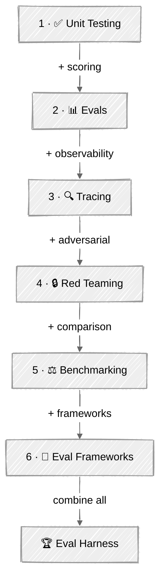

<!-- ---
title: "Testing & Evaluation"
description: "Measure quality, catch regressions, and build confidence in AI agents before shipping"
--- -->

# Testing & Evaluation

Agents are non-deterministic — testing them requires different thinking. This module teaches the mental models, patterns, and techniques for building confidence in AI agents before shipping. Following Anthropic's principle of **eval-driven development**, you'll learn to define success criteria before building, measure quality continuously, and catch regressions automatically.

## 🗺️ Progression Path

| Step | Tutorial | What It Adds |
|:----:|----------|-------------|
| 1 | [Unit Testing Agents](01-unit-testing-agents/) | Mock LLMs, tool isolation, behavioral contracts |
| 2 | [Evals](02-evals/) | + golden datasets, LLM-as-judge, pass@k/pass^k metrics |
| 3 | [Tracing & Debugging](03-tracing-debugging/) | + execution traces, span trees, failure analysis |
| 4 | [Red Teaming & Safety](04-red-teaming-safety/) | + prompt injection, guardrail verification |
| 5 | [Benchmarking](05-benchmarking/) | + head-to-head model/prompt comparison |
| 6 | [Eval Frameworks](06-eval-frameworks/) | + Promptfoo, Braintrust, Langfuse integration |
| 🏆 | [Eval Harness](07-eval-harness/) | Combines all techniques into a full pipeline |

## 💡 Tips for Success

1. **Start with unit tests** — they're fast, free, and catch most bugs in agent scaffolding
2. **Build golden datasets early** — curate 20-50 representative tasks before optimizing
3. **Use multiple grader types** — combine code-based (fast, cheap) with LLM-as-judge (nuanced)
4. **Trace everything** — when an agent fails, the trace shows *why*
5. **Think like an attacker** — red teaming reveals vulnerabilities you didn't design for
6. **Benchmark with data, not vibes** — measure accuracy, cost, and latency together
7. **Run evals in CI/CD** — catch regressions before they reach production
8. **Grade outputs, not paths** — avoid checking specific tool call sequences; agents find valid approaches you didn't anticipate

## 📚 Tutorials

### [01 - Unit Testing Agents](01-unit-testing-agents/)

**What you'll learn:**
- Mock LLM responses for deterministic testing
- Test tool execution in isolation
- Verify behavioral contracts (things the agent must always/never do)
- Run fast, cheap tests without API calls

**Key concepts:** Mock-and-replay, tool isolation, behavioral invariants, pytest

---

### [02 - Evals](02-evals/)

**What you'll learn:**
- Build code-based graders (keyword matching, regex, source citation)
- Implement the LLM-as-judge pattern with structured rubrics
- Create end-to-end evaluation pipelines with golden datasets
- Compute pass@k (capability) and pass^k (consistency) metrics
- Categorize evals as capability vs regression tests
- Calibrate LLM judges against human baselines

**Evolution:** Moves beyond deterministic assertions to statistical evaluation of agent quality

---

### [03 - Tracing & Debugging](03-tracing-debugging/)

**What you'll learn:**
- Build a span-based trace collector with context managers
- Analyze execution traces to detect anti-patterns
- Debug agent failures using recorded traces
- Replay agent execution from checkpoints

**Evolution:** Adds full observability — when an eval fails, the trace shows exactly why

---

### [04 - Red Teaming & Safety](04-red-teaming-safety/)

**What you'll learn:**
- Test agents against prompt injection attacks (direct and indirect)
- Build and verify defense-in-depth guardrail pipelines
- Run automated LLM-vs-LLM red teaming
- Measure Attack Success Rate (ASR)

**Evolution:** Adds adversarial testing — probes for vulnerabilities before attackers do

---

### [05 - Benchmarking](05-benchmarking/)

**What you'll learn:**
- Compare models on accuracy, latency, cost, and token efficiency
- Evaluate prompt strategies (zero-shot, few-shot, chain-of-thought)
- Build configuration matrices and find Pareto-optimal setups
- Make data-driven model selection decisions

**Evolution:** Adds systematic comparison — replace vibes with measurements

---

### [06 - Eval Frameworks](06-eval-frameworks/)

**What you'll learn:**
- Define eval suites declaratively with **Promptfoo** (YAML + custom Python providers)
- Use **Braintrust AutoEvals** pre-built scorers (Levenshtein, Factuality, custom classifiers)
- Instrument agents with **Langfuse** tracing and programmatic scoring
- Compare framework tradeoffs: CLI vs SDK, local vs cloud

**Evolution:** Connects hand-built evals to production frameworks recommended in Anthropic's eval guide

---

### 🏆 [07 - Eval Harness](07-eval-harness/)

**What you'll learn:**
- Combine all testing techniques into a unified pipeline
- Build a reusable evaluation harness with Pydantic data models
- Generate comprehensive quality, safety, and benchmark reports
- Practice eval-driven development end-to-end
- Run in simulated mode (instant, no API keys) or live mode (`--live` with real API calls)

**Evolution:** The capstone — wires unit testing patterns, evals, tracing, red teaming, and benchmarking into a single eval harness

---

## 🔗 Resources

### Evaluation & Testing
- [Demystifying Evals for AI Agents — Anthropic](https://www.anthropic.com/engineering/demystifying-evals-for-ai-agents) — Core eval vocabulary, grader taxonomy, 8-step roadmap
- [Building Effective Agents — Anthropic](https://www.anthropic.com/research/building-effective-agents) — Agent patterns that inform what to test
- [OpenAI Evaluation Best Practices](https://platform.openai.com/docs/guides/evaluation-best-practices) — Practical eval guidance
- [Eval-Driven Development](https://evaldriven.org/) — The discipline of building evals before features
- [Judging LLM-as-a-Judge with MT-Bench and Chatbot Arena — Zheng et al., 2023](https://arxiv.org/abs/2306.05685) — Systematic study of LLM judges and structured rubric scoring
- [Holistic Evaluation of Language Models (HELM) — Liang et al., 2022](https://arxiv.org/abs/2211.09110) — Multi-metric evaluation covering accuracy, robustness, fairness, and efficiency

### Eval Frameworks
- [Promptfoo](https://www.promptfoo.dev/) — YAML-driven eval CLI with Python provider support
- [Braintrust AutoEvals](https://github.com/braintrustdata/autoevals) — Pre-built scorers for factuality, similarity, and custom classifiers
- [Langfuse](https://langfuse.com/) — Open-source tracing and evaluation platform
- [Harbor](https://github.com/harbor-ai/harbor) — Containerized agent eval environments
- [LangSmith](https://smith.langchain.com/) — Tracing and evaluation with LangChain integration

### Security & Safety
- [OWASP Top 10 for LLM Applications](https://owasp.org/www-project-top-10-for-large-language-model-applications/) — Security vulnerability taxonomy
- [OWASP Top 10 for Agentic Applications](https://owasp.org/www-project-top-10-for-agentic-applications/) — Agent-specific security concerns
- [Not What You've Signed Up For: Indirect Prompt Injection — Greshake et al., 2023](https://arxiv.org/abs/2302.12173) — Compromising LLM-integrated applications via tool outputs and external content
- [Red Teaming Language Models to Reduce Harms — Ganguli et al., 2022](https://arxiv.org/abs/2209.07858) — Anthropic's systematic red teaming methodology

### Observability & Benchmarking
- [LLM-as-a-Judge Guide — Langfuse](https://langfuse.com/docs/evaluation/evaluation-methods/llm-as-a-judge) — Comprehensive LLM judge patterns
- [AI Agent Benchmarks — Evidently AI](https://www.evidentlyai.com/blog/ai-agent-benchmarks) — Benchmark landscape overview
- [Agent Evaluation in 2025 — orq.ai](https://orq.ai/blog/agent-evaluation) — Three evaluation strategies
- [Chatbot Arena: Evaluating LLMs by Human Preference — Chiang et al., 2024](https://arxiv.org/abs/2403.04132) — Elo-rated human preference benchmarking methodology

### Key Papers
- [Beyond Accuracy: Behavioral Testing of NLP Models with CheckList — Ribeiro et al., 2020](https://arxiv.org/abs/2005.04118) — Behavioral testing with invariance, directional, and minimum functionality tests
- [Chain-of-Thought Prompting Elicits Reasoning — Wei et al., 2022](https://arxiv.org/abs/2201.11903) — CoT prompting for significant accuracy gains on reasoning tasks
- [Language Models are Few-Shot Learners — Brown et al., 2020](https://arxiv.org/abs/2005.14165) — In-context few-shot learning as a prompting paradigm
