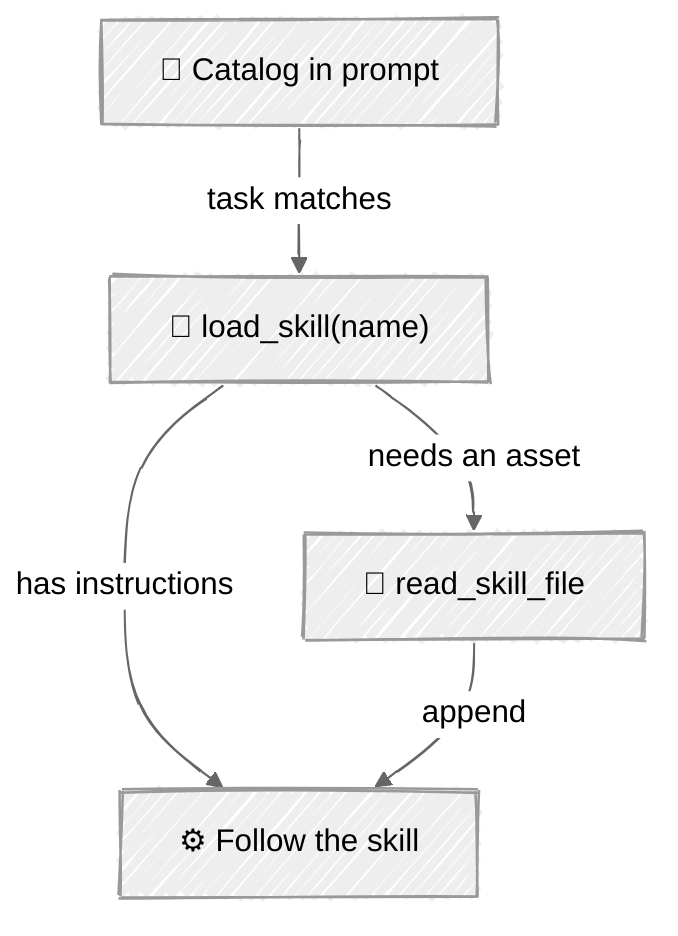

<!-- ---
title: "Skills"
description: "Inject specialized capabilities on demand with filesystem-based Agent Skills and progressive disclosure"
icon: "sparkles"
--- -->

# Skills

A big system prompt that lists every capability the agent might need is expensive on every call and dilutes the model's attention. **Skills** flip this: keep a cheap catalog always loaded, and pull in full instructions (and bundled assets) only when a task actually calls for them. This is the pattern behind Claude's Agent Skills — and it's just a folder convention plus two tools.

## 🎯 What You'll Learn

- Structure a `SKILL.md` with YAML front-matter (`name`, `description`) and a Markdown body
- Implement three-tier progressive disclosure: catalog → `load_skill` → read bundled files
- Discover skills from the filesystem and inject a lightweight catalog into the system prompt
- Guard skill file access against path traversal

## 📦 Available Examples

| Provider                                        | File                                             | Description                              |
| ----------------------------------------------- | ------------------------------------------------ | ---------------------------------------- |
|  | [01_skills_anthropic.py](01_skills_anthropic.py) | Skill discovery + loading with Claude    |
|        | [02_skills_openai.py](02_skills_openai.py)       | Same skills via the OpenAI Responses API |

Sample skills live in [`skills/`](skills/): `code-reviewer` and `changelog` (the latter bundles a `template.md` to demonstrate tier-3 disclosure).

## 🚀 Quick Start

> **Prerequisites:** Python 3.11+, API keys, and uv. See [SETUP.md](../../SETUP.md) for full setup instructions.

```bash
uv run --directory 05-loop-engineering/01-skills python {script_name}

# Example
uv run --directory 05-loop-engineering/01-skills python 01_skills_anthropic.py
```

Or use the [Code Runner](https://marketplace.visualstudio.com/items?itemName=formulahendry.code-runner) VS Code extension to run the currently open script with a single click.

## 🔑 Key Concepts

### 1. A skill is a folder

Each skill is a directory with a `SKILL.md`: YAML front-matter for the catalog, Markdown body for the instructions, plus any bundled assets.

```
skills/
  code-reviewer/
    SKILL.md
  changelog/
    SKILL.md
    template.md      # loaded on demand (tier 3)
```

```markdown
---
name: changelog
description: Write or update a project CHANGELOG entry. Use when the user asks for release notes.
---

# Changelog
Read `template.md` for the exact layout, then group changes under Added / Changed / Fixed / Removed.
```

### 2. Progressive disclosure

The whole point is to spend context only when needed. Three tiers:



1. **Catalog** — every skill's `name` + `description` is injected into the system prompt. Cheap, always present.
2. **`load_skill(name)`** — returns the full `SKILL.md` body only for the skill the model chooses.
3. **`read_skill_file(skill, path)`** — pulls in bundled files (templates, examples) when the instructions reference them.

### 3. Discovery + safe loading

Skills are discovered by scanning `skills/*/SKILL.md` and parsing front-matter (`discover_skills`). File access is resolved against the skill directory and rejected if it escapes — see `safe_skill_path`:

```python
def safe_skill_path(catalog, skill, relative):
    base = (SKILLS_DIR / catalog[skill]["dir"]).resolve()
    target = (base / relative).resolve()
    if not target.is_relative_to(base):
        raise ValueError(f"Path traversal blocked: {relative}")
    return target
```

The agent loop itself is the one from [Agent Loop](../../01-foundations/05-agent-loop/) — skills only change what tools are available and what the system prompt advertises.

## ⚠️ Important Considerations

- **Descriptions are routing signals.** The model picks skills from the catalog descriptions alone, so write them like trigger conditions ("Use when...").
- **Path traversal is a real risk.** Any tool that reads a model-supplied path must be sandboxed to an allowlisted root.
- **Keep bodies focused.** A skill that loads 5,000 tokens defeats the purpose — push detail into bundled files read only when needed.

## 👉 Next Steps

- Next: [Hooks & Lifecycle](../02-hooks-lifecycle/) — intercept the loop to add control and guardrails.
- Add a skill that bundles a script and have the agent execute it (pairs well with [Sandboxing](../03-sandboxing/)).
- Let skills be contributed as a plugin folder discovered at startup.
