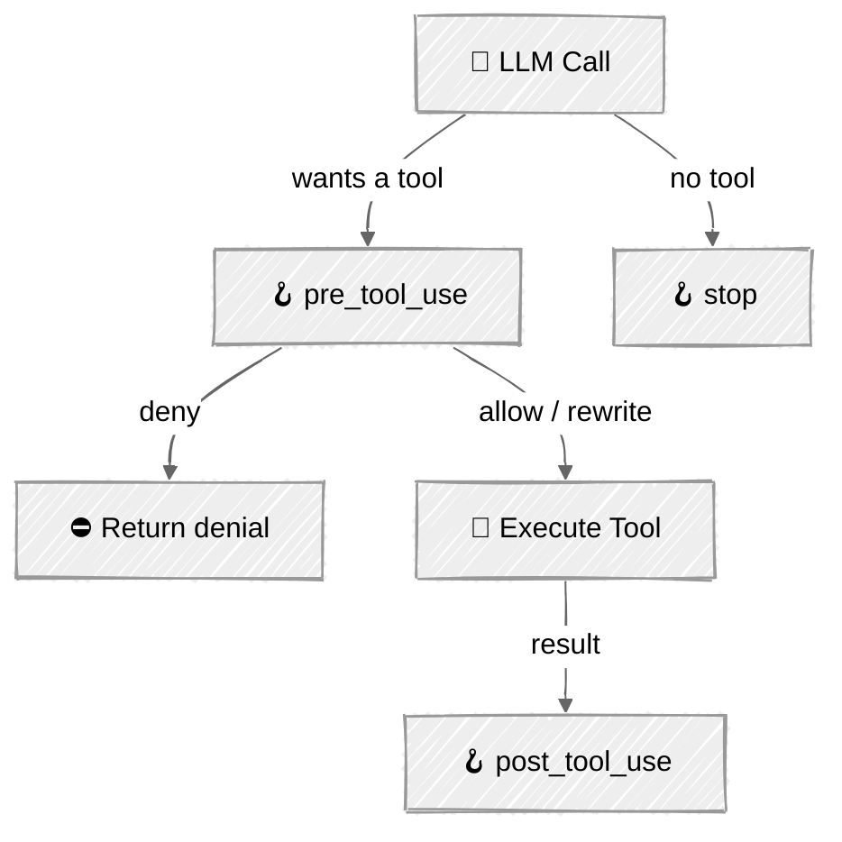

<!-- ---
title: "Hooks & Lifecycle"
description: "Intercept the agent loop at pre/post tool-use and stop events with pluggable callbacks"
icon: "git-branch"
--- -->

# Hooks & Lifecycle

The moment your agent does anything real, you need to intervene in the loop: log every action, block dangerous ones, ask for approval, redact secrets. Stuffing that logic inline turns the loop into a tangle of `if` statements. **Hooks** give you named interception points instead — register a callback for a lifecycle event and the loop calls it for you.

This is the extensibility seam the rest of the module plugs into: sandboxing, MCP policy, and subagent limits can all be expressed as hooks.

## 🎯 What You'll Learn

- Design a hook registry mapping lifecycle events to ordered callbacks
- Handle `pre_tool_use`, `post_tool_use`, and `stop` events
- Return allow / deny / rewrite decisions from a pre-tool-use hook
- Re-express blocked-command guardrails as a first-class hook

## 📦 Available Examples

| Provider                                        | File                                           | Description                            |
| ----------------------------------------------- | ---------------------------------------------- | -------------------------------------- |
|  | [01_hooks_anthropic.py](01_hooks_anthropic.py) | Hooked agent loop with Claude          |
|        | [02_hooks_openai.py](02_hooks_openai.py)       | Same hooks via the OpenAI Responses API |

## 🚀 Quick Start

> **Prerequisites:** Python 3.11+, API keys, and uv. See [SETUP.md](../../SETUP.md) for full setup instructions.

```bash
uv run --directory 05-loop-engineering/02-hooks-lifecycle python {script_name}

# Example
uv run --directory 05-loop-engineering/02-hooks-lifecycle python 01_hooks_anthropic.py
```

Or use the [Code Runner](https://marketplace.visualstudio.com/items?itemName=formulahendry.code-runner) VS Code extension to run the currently open script with a single click.

## 🔑 Key Concepts

### 1. Lifecycle events

The loop from [Agent Loop](../../01-foundations/05-agent-loop/) fires three events. `pre_tool_use` is the powerful one — it can stop or change a call before it runs.



### 2. The registry and the decision

A hook is just a callback registered against an event. `pre_tool_use` hooks return a `HookDecision`:

```python
@dataclass
class HookDecision:
    allow: bool = True
    reason: str = ""
    tool_input: dict | None = None   # rewrite the call
```

The registry runs hooks in order — the first denial wins, and rewrites chain through so one hook can sanitize what the next one sees.

### 3. Guardrails as a hook

The blocked-command check that lived inside the tool executor in [Tool Use](../../01-foundations/04-tool-use/) becomes a standalone, reusable hook:

```python
def block_dangerous_commands(name, tool_input):
    if name != "bash":
        return None
    lowered = tool_input.get("command", "").lower()
    for blocked in BLOCKED_COMMANDS:
        if blocked in lowered:
            return HookDecision(allow=False, reason=f"blocked token '{blocked}'")
    return None

registry.register(PRE_TOOL_USE, log_tool_call)
registry.register(PRE_TOOL_USE, block_dangerous_commands)
```

When a hook denies a call, the loop still returns a `tool_result` to the model (the denial message) so the conversation stays valid and the model can adapt.

## ⚠️ Important Considerations

- **Always answer a `tool_use`.** A denied call must still produce a `tool_result`, or the next API call errors.
- **Order matters.** Put sanitizing/rewriting hooks before deny hooks if the deny check should see the cleaned input.
- **Keep hooks fast and pure.** They run on the hot path of every tool call; heavy work belongs in `post_tool_use` or a background sink.
- **Approval gates fit here too.** A `pre_tool_use` hook that prompts a human is exactly the [Human-in-the-Loop](../../02-effective-agents/06-human-in-the-loop/) pattern applied at the tool boundary.

## 👉 Next Steps

- Next: [Sandboxing](../03-sandboxing/) — make the `bash` tool safe to run for real, not just guarded by a denylist.
- Add a `pre_tool_use` approval hook that pauses for `y/n` on writes.
- Add a `post_tool_use` hook that redacts secrets from results before they re-enter the context.
