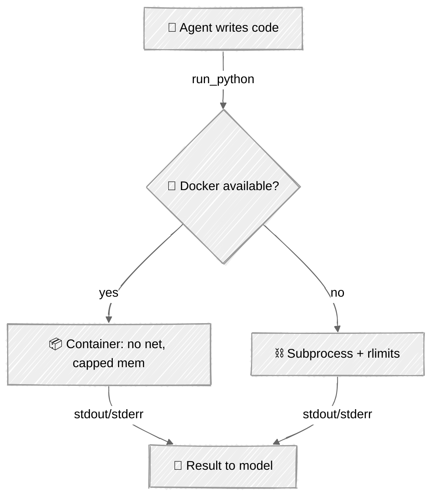

<!-- ---
title: "Sandboxing"
description: "Run agent-generated code and tool calls in isolation with resource limits and timeouts"
icon: "shield"
--- -->

# Sandboxing

The fastest way to a capable agent is to let it write and run code. The fastest way to a disaster is to run that code on your machine. **Sandboxing** puts a boundary between the agent's `run_python` tool and the host — so a runaway loop, a fork bomb, or `open('/etc/passwd')` hits a wall instead of your filesystem.

A denylist (from [Hooks](../02-hooks-lifecycle/)) stops known-bad *commands*; a sandbox contains *arbitrary code* you never get to inspect first.

## 🎯 What You'll Learn

- Contain execution with `subprocess`, `resource.setrlimit`, and a stripped environment
- Enforce CPU, memory, file-size, and wall-clock limits on agent-run code
- Add a Docker tier (`--network none`, capped memory) for a real isolation boundary
- Reason honestly about what each tier protects against — and what it doesn't

## 📦 Available Examples

| Provider                                        | File                                               | Description                              |
| ----------------------------------------------- | -------------------------------------------------- | ---------------------------------------- |
|  | [01_sandbox_anthropic.py](01_sandbox_anthropic.py) | Sandboxed code-runner agent with Claude  |
|        | [02_sandbox_openai.py](02_sandbox_openai.py)       | Same agent via the OpenAI Responses API  |

Both share [`sandbox.py`](sandbox.py), which holds the two execution backends.

## 🚀 Quick Start

> **Prerequisites:** Python 3.11+, API keys, and uv. Docker is optional — the subprocess tier runs without it. See [SETUP.md](../../SETUP.md).

```bash
uv run --directory 05-loop-engineering/03-sandboxing python {script_name}

# Example
uv run --directory 05-loop-engineering/03-sandboxing python 01_sandbox_anthropic.py
```

Or use the [Code Runner](https://marketplace.visualstudio.com/items?itemName=formulahendry.code-runner) VS Code extension to run the currently open script with a single click.

## 🔑 Key Concepts

### 1. Two tiers, chosen automatically



`run_sandboxed()` prefers Docker and falls back to the subprocess tier, so the tutorial runs anywhere but uses the stronger boundary when it exists.

### 2. The portable tier: subprocess + rlimits

Run the snippet in a throwaway directory, with a minimal environment, in isolated mode (`python -I`), with hard limits applied in the child before `exec`:

```python
def _apply_limits():
    resource.setrlimit(resource.RLIMIT_CPU, (CPU_SECONDS, CPU_SECONDS))
    resource.setrlimit(resource.RLIMIT_AS, (MEMORY_BYTES, MEMORY_BYTES))
    resource.setrlimit(resource.RLIMIT_FSIZE, (FILE_SIZE_BYTES, FILE_SIZE_BYTES))

subprocess.run(["python", "-I", script], cwd=tmp, env={...},
               timeout=WALL_TIMEOUT, preexec_fn=_apply_limits)
```

This **contains accidents** — infinite loops, memory blowups, giant files. It is *not* a security boundary: the code still shares your kernel and (unless you block it) your network.

### 3. The real tier: Docker

```python
subprocess.run(["docker", "run", "--rm", "--network", "none",
                "--memory", "256m", "--cpus", "1", "--pids-limit", "128",
                "-v", f"{script}:/snippet.py:ro", image, "python", "-I", "/snippet.py"])
```

A separate namespace, no network, capped memory and PIDs. This is the boundary you'd actually ship behind. For stronger isolation still, run under [gVisor](https://gvisor.dev/) or a microVM (Firecracker).

## ⚠️ Important Considerations

- **Be honest about the threat model.** subprocess + rlimits stops mistakes; Docker/gVisor stops adversaries. Don't market the former as the latter.
- **`preexec_fn` / `setrlimit` are POSIX-only.** These examples target Linux/macOS. On Windows, use containers or Job Objects.
- **Network is the sharp edge.** The subprocess tier does not block egress; `--network none` does. Untrusted code with network access can exfiltrate.
- **`RLIMIT_AS` too low breaks the interpreter.** Give Python enough address space to start (512 MB here) or it dies before your code runs.
- **Combine with hooks.** Gate `run_python` behind a `pre_tool_use` approval hook when the stakes are high.

## 👉 Next Steps

- Next: [MCP Integration](../04-mcp/) — discover tools from external servers instead of hand-coding them.
- Add a `run_bash` sandbox tier and diff its risks against `run_python`.
- Put a filesystem allowlist (bind-mount a scratch dir) so sandboxed code can persist approved outputs.
