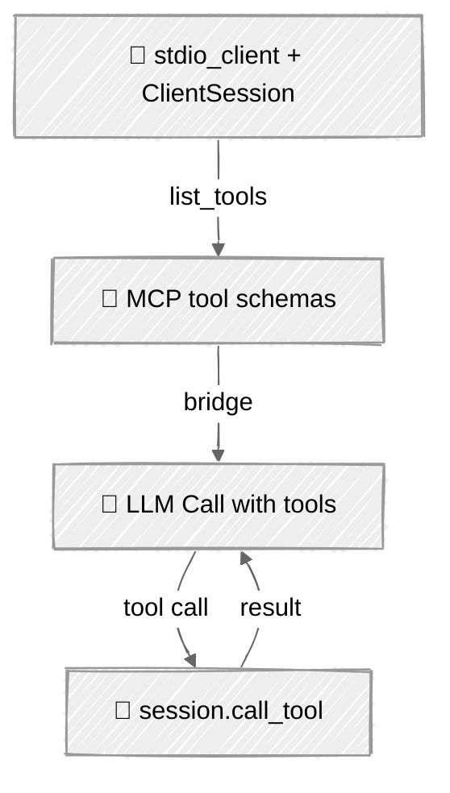

<!-- ---
title: "MCP Integration"
description: "Discover tools from Model Context Protocol servers and publish your own"
icon: "plug"
--- -->

# MCP Integration

Every agent so far hand-coded its tools. That doesn't scale: every integration is bespoke, and none of it is reusable across agents. The **Model Context Protocol** standardizes the boundary — a server advertises tools, any client discovers and calls them. Point your loop at an MCP server and its tools appear at runtime; publish a server and any MCP-speaking agent can use yours.

## 🎯 What You'll Learn

- Use the `mcp` Python SDK to open a client session, list tools, and call them
- Bridge MCP tool schemas into both Anthropic and OpenAI tool formats
- Build a small MCP server with `FastMCP`
- Run an async agent loop that routes every tool call through the MCP session

## 📦 Available Examples

| Provider                                        | File                                     | Description                                 |
| ----------------------------------------------- | ---------------------------------------- | ------------------------------------------- |
|  | [01_mcp_anthropic.py](01_mcp_anthropic.py) | MCP client bridged into Claude's tool loop  |
|        | [02_mcp_openai.py](02_mcp_openai.py)     | MCP client bridged into the Responses API   |
| 🛠️                                              | [03_mcp_server.py](03_mcp_server.py)     | A minimal FastMCP server (spawned by both)  |

## 🚀 Quick Start

> **Prerequisites:** Python 3.11+, API keys, and uv. See [SETUP.md](../../SETUP.md) for full setup instructions.

The client scripts spawn the server automatically — just run a client:

```bash
uv run --directory 05-loop-engineering/04-mcp python {script_name}

# Example
uv run --directory 05-loop-engineering/04-mcp python 01_mcp_anthropic.py
```

Or use the [Code Runner](https://marketplace.visualstudio.com/items?itemName=formulahendry.code-runner) VS Code extension to run the currently open script with a single click.

## 🔑 Key Concepts

### 1. Publish tools with FastMCP

A server is a handful of decorated functions. Type hints become the tool's input schema automatically.

```python
from mcp.server.fastmcp import FastMCP

mcp = FastMCP("loop-engineering-demo")

@mcp.tool()
def word_count(text: str) -> int:
    """Count the number of whitespace-separated words in the text."""
    return len(text.split())

if __name__ == "__main__":
    mcp.run()   # stdio transport by default
```

### 2. Discover and call from the client



The SDK gives you an async session over the server's stdio:

```python
async with stdio_client(SERVER) as (read, write), ClientSession(read, write) as session:
    await session.initialize()
    listing = await session.list_tools()
    result = await session.call_tool(name, arguments)
```

### 3. Bridge the schemas

MCP's tool definitions map almost 1:1 onto each provider's format — only the field names differ:

```python
# Anthropic
{"name": t.name, "description": t.description, "input_schema": t.inputSchema}

# OpenAI Responses
{"type": "function", "name": t.name, "description": t.description, "parameters": t.inputSchema}
```

Execution changes too: instead of a local `execute_tool`, the loop `await session.call_tool(...)` and flattens the returned content blocks back into a string.

## ⚠️ Important Considerations

- **The loop goes async.** MCP calls are coroutines, so the whole session runs under `asyncio.run`. Blocking `input()` is fine for a single-user CLI.
- **Anthropic's native MCP connector is different.** The API can call remote MCP servers directly via an `mcp_servers` beta param — but it's URL-only and tool-only, and the beta header version moves (e.g. `mcp-client-2025-04-04`). The SDK-bridge approach here works for both providers and any transport.
- **Trust boundary.** An MCP server is code you're granting tool access to. Vet third-party servers and combine remote tools with [Hooks](../02-hooks-lifecycle/) and [Sandboxing](../03-sandboxing/).
- **Schema strictness.** OpenAI strict mode requires `additionalProperties: false`; the examples run non-strict so server-generated schemas pass as-is.

## 👉 Next Steps

- Next: [Subagents & Delegation](../05-subagents/) — scale the loop by delegating to child agents.
- Add a stateful MCP tool (a tiny key-value store) and watch the agent use it across turns.
- Connect to a real community MCP server (filesystem, GitHub) instead of the demo.
