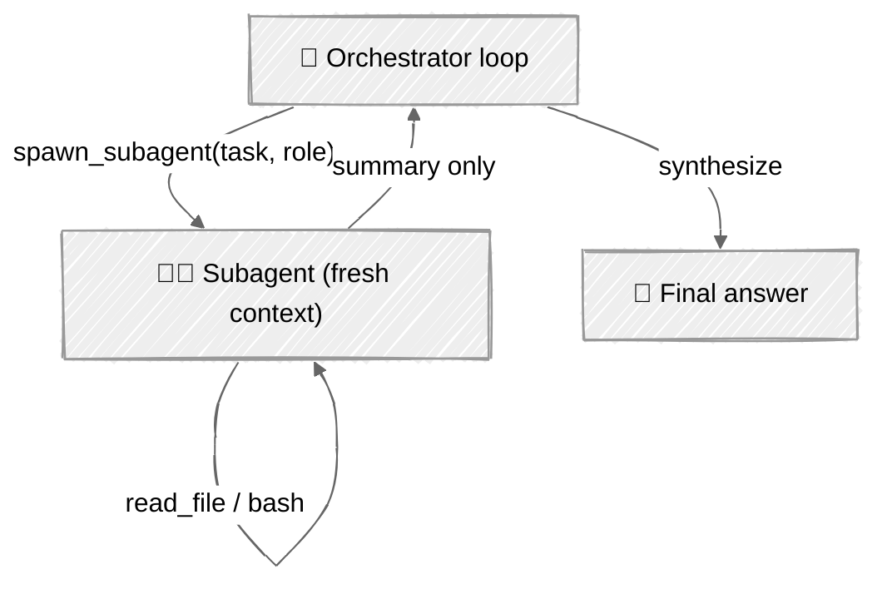

<!-- ---
title: "Subagents & Delegation"
description: "Spawn child loops with isolated context that run a subtask and return a summary"
icon: "users"
--- -->

# Subagents & Delegation

One agent, one context window. As tasks grow, that window fills with tool output the model barely needs — file dumps, search results, dead ends. **Delegation** fixes this: the parent spins up a subagent with a fresh context, hands it a subtask, and gets back only a summary. The parent stays focused on the plan; the messy details live and die in the child.

This is the pattern behind Claude Code's `Task` tool and every orchestrator-workers system — built here from the loop up.

## 🎯 What You'll Learn

- Model a parent agent spawning child agents with isolated context
- Return compact summaries instead of full child transcripts
- Enforce delegation depth (workers can't delegate) and a fan-out limit
- Aggregate child token usage into the parent's report

## 📦 Available Examples

| Provider                                        | File                                                   | Description                                |
| ----------------------------------------------- | ------------------------------------------------------ | ------------------------------------------ |
|  | [01_subagents_anthropic.py](01_subagents_anthropic.py) | Orchestrator + workers with Claude         |
|        | [02_subagents_openai.py](02_subagents_openai.py)       | Same split via the OpenAI Responses API    |

## 🚀 Quick Start

> **Prerequisites:** Python 3.11+, API keys, and uv. See [SETUP.md](../../SETUP.md) for full setup instructions.

```bash
uv run --directory 05-loop-engineering/05-subagents python {script_name}

# Example
uv run --directory 05-loop-engineering/05-subagents python 01_subagents_anthropic.py
```

Or use the [Code Runner](https://marketplace.visualstudio.com/items?itemName=formulahendry.code-runner) VS Code extension to run the currently open script with a single click.

## 🔑 Key Concepts

### 1. Two roles, two contexts

The parent's only tool is `spawn_subagent`. Workers have the real tools and their own message history.



### 2. Isolation is just a fresh message list

A subagent is the same agent loop with its own `messages`, its own system prompt, and no visibility into the parent. It runs to completion and hands back its final text:

```python
def spawn_subagent(self, task, role):
    if self.subagent_count >= MAX_SUBAGENTS:
        return f"Error: subagent limit ({MAX_SUBAGENTS}) reached"
    self.subagent_count += 1
    messages = [{"role": "user", "content": task}]   # fresh, isolated context
    # ... run the worker loop with WORKER_TOOLS ...
    return final_summary
```

### 3. Guardrails against runaway trees

Unbounded delegation is a fork bomb with a credit card. Two limits keep it safe:

- **Fan-out cap** — `MAX_SUBAGENTS` per parent run.
- **Depth 1** — workers don't get the `spawn_subagent` tool, so the tree can't recurse.

Both providers share one token tracker across parent and children, so the end-of-session report covers the whole tree.

## ⚠️ Important Considerations

- **The summary is the interface.** Prompt workers to return exactly what the parent needs; a bloated summary defeats the point.
- **Depth and fan-out are cost multipliers.** Every level multiplies token spend — cap both, and log how many you spawned (this example prints the count).
- **Errors shouldn't be silent.** A worker that hits its iteration limit returns a marker string, not an exception, so the parent can react.
- **Parallelism.** These examples delegate sequentially for clarity; workers with independent subtasks can run concurrently (see [Parallelization](../../02-effective-agents/03-parallelization/)).

## 👉 Next Steps

- Next: [Context Compaction](../06-context-compaction/) — keep a single long-running loop alive when you *can't* delegate the context away.
- Run workers concurrently with `asyncio` and compare wall-clock time.
- Give workers the sandbox from [Sandboxing](../03-sandboxing/) so delegated code runs safely.
