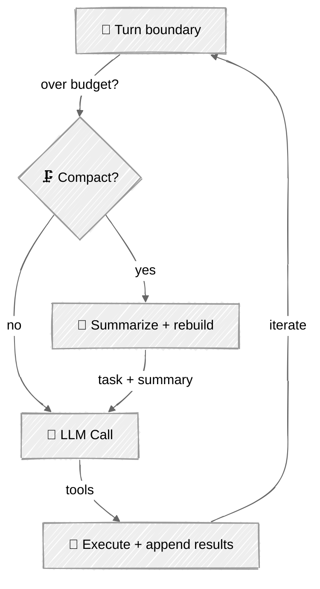

<!-- ---
title: "Context Compaction"
description: "Keep long-running loops alive by compacting their own history mid-run"
icon: "scissors"
--- -->

# Context Compaction

An agent that runs long enough will fill its context window with tool output it no longer needs — file dumps, command logs, exploration it already learned from. Left alone, the loop dies with a context-length error. **Compaction** is the agent summarizing its own past mid-run: keep the goal, distill the history, drop the bulk, and keep going.

[Subagents](../05-subagents/) push context *out* to children. Compaction is what you do when the work is one long thread you can't delegate away.

## 🎯 What You'll Learn

- Trigger compaction as a loop-lifecycle event with a token-budget check
- Summarize the transcript while pinning the original task, then continue
- Preserve `tool_use`/`tool_result` pairing so the API never 400s
- Handle compaction on the OpenAI Responses API by managing input locally

## 📦 Available Examples

| Provider                                        | File                                                     | Description                               |
| ----------------------------------------------- | -------------------------------------------------------- | ----------------------------------------- |
|  | [01_compaction_anthropic.py](01_compaction_anthropic.py) | Self-compacting loop with Claude          |
|        | [02_compaction_openai.py](02_compaction_openai.py)       | Compaction via locally-managed input      |

## 🚀 Quick Start

> **Prerequisites:** Python 3.11+, API keys, and uv. See [SETUP.md](../../SETUP.md) for full setup instructions.

```bash
uv run --directory 05-loop-engineering/06-context-compaction python {script_name}

# Example
uv run --directory 05-loop-engineering/06-context-compaction python 01_compaction_anthropic.py
```

The token budget is set deliberately low (`COMPACT_TOKEN_BUDGET = 3000`) so compaction fires within a short session. Try a task that reads several files.

## 🔑 Key Concepts

### 1. Compaction is a lifecycle event

Each iteration, before calling the model, check the budget. If the transcript is too big, summarize and rebuild — then proceed.



### 2. Only compact at a turn boundary

The one rule that matters: **never split an assistant `tool_use` from its `tool_result`.** Anthropic returns a 400 if a `tool_use` block has no matching result in the next message. Because compaction runs at the top of the loop — after results were appended, before the next call — there's never an open pair to break:

```python
if len(messages) > 2 and estimate_tokens(messages) > COMPACT_TOKEN_BUDGET:
    messages = self._compact(task, messages)   # safe: last turn is complete
```

Compaction collapses everything into one primed user message so roles stay valid:

```python
return [{"role": "user",
         "content": f"{task}\n\n[Progress summary so far]:\n{summary}\n\nContinue the task."}]
```

### 3. OpenAI: give up the server-side chain

The Responses API normally threads history with `previous_response_id`, but then *the server* holds the transcript and you can't rewrite it. To compact, keep the full input list locally and re-send it each turn (appending the model's own output items so tool outputs still match):

```python
input_messages += list(response.output)          # model's function_call items
input_messages.append(function_call_output_item) # your tool result
# ...later, when over budget:
input_messages = self._compact(task, input_messages)
```

## ⚠️ Important Considerations

- **Estimation vs. truth.** These examples use a ~4-chars/token heuristic; for production, count with the real tokenizer (see [Context Engineering](../../03-advanced-techniques/03-context-engineering/)).
- **Summaries lose detail.** Compaction trades fidelity for survival. Pin what must never be lost (the task, hard constraints, IDs) outside the summarized region.
- **Compaction costs a call.** The summary is itself an LLM request — worth it versus a dead loop, but don't compact every turn. Budget with hysteresis.
- **Don't split tool pairs.** If you ever compact mid-turn, drop the whole `tool_use`+`tool_result` pair together, never one side.

## 👉 Next Steps

- Next: [Extensible Agent](../07-extensible-agent/) — the capstone that wires this together with hooks, sandbox, MCP, and subagents.
- Swap the heuristic for a real token count and compact on a percentage of the model's window.
- Keep the last N turns verbatim after the summary for better local continuity.
