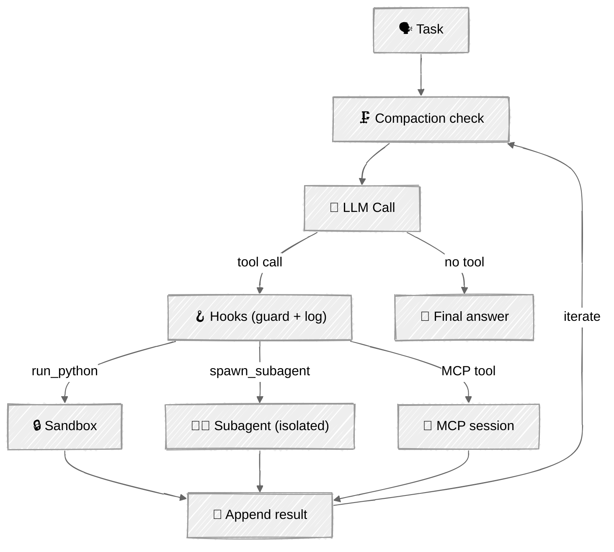

<!-- ---
title: "Extensible Agent"
description: "Capstone — one agent wired with hooks, sandbox, MCP, subagents, and compaction"
icon: "boxes"
--- -->

# Extensible Agent 🏆

**Capstone.** Every tutorial in this module added one control surface to the agent loop. Here they come together in a single agent — and the lesson is composition: each layer stays independent and swappable, so the loop at the center is still the same loop you built in Foundations.

## 🎯 What You'll Learn

- Wire hooks, sandboxing, MCP, subagents, and compaction into one coherent loop
- Keep each primitive an independent layer rather than a tangled special case
- Drive an end-to-end task that exercises every control surface at once
- See which harness concerns a framework would (and wouldn't) abstract away

## 📦 Available Examples

| Provider                                        | File                                                                 | Description                          |
| ----------------------------------------------- | -------------------------------------------------------------------- | ------------------------------------ |
|  | [01_extensible_agent_anthropic.py](01_extensible_agent_anthropic.py) | Full capstone with Claude            |
|        | [02_extensible_agent_openai.py](02_extensible_agent_openai.py)       | Full capstone via the Responses API  |

Shared building blocks live in [`components.py`](components.py); the MCP server is [`mcp_server.py`](mcp_server.py) (spawned automatically).

## 🚀 Quick Start

> **Prerequisites:** Python 3.11+, API keys, and uv. See [SETUP.md](../../SETUP.md) for full setup instructions.

```bash
uv run --directory 05-loop-engineering/07-extensible-agent python {script_name}

# Example
uv run --directory 05-loop-engineering/07-extensible-agent python 01_extensible_agent_anthropic.py
```

Or use the [Code Runner](https://marketplace.visualstudio.com/items?itemName=formulahendry.code-runner) VS Code extension to run the currently open script with a single click.

## 🔑 Key Concepts

### 1. Five layers, one loop



### 2. Composition, not a rewrite

The agent's tool list is just `[run_python, spawn_subagent, *mcp_tools]`. A single `_dispatch` routes each call — sandbox, subagent, or MCP — and **every path goes through the same hook pipeline**:

```python
async def _dispatch(self, session, mcp_names, name, args):
    if name == "run_python":     return self._run_python_guarded(args)   # sandbox + hooks
    if name == "spawn_subagent": return self._spawn_subagent(...)        # isolated worker
    if name in mcp_names:        # hooks + MCP session
        decision = self.hooks.run_pre_tool_use(name, args)
        ...
```

Compaction sits at the top of the loop (a lifecycle event); the hook registry wraps the tool boundary; the sandbox backs one tool; subagents fork the loop. None of them knows about the others.

### 3. Scoped for real, not for show

Deliberate ceilings keep the capstone honest and runnable: one MCP server, subagent **depth 1** (workers get only `run_python`), the subprocess sandbox tier, token-threshold compaction, and two built-in hooks (log + a guardrail that denies networked/host-reaching code). Each is the smallest version that still demonstrates the pattern.

## ⚠️ Important Considerations

- **The loop is async** because MCP is. Subagents run synchronously inside it — fine for a single user, but real fan-out would use `asyncio.gather`.
- **Layer independence is the deliverable.** If adding a sixth capability forces edits across all five others, the composition has leaked — keep the seams clean.
- **Cost compounds.** Subagents, compaction summaries, and retries all spend tokens; the session prints subagent and compaction counts so the cost is visible.
- **This is what frameworks package.** Now that you've built each layer, you can judge what [LangGraph, CrewAI, and friends](../../06-frameworks/) actually buy you — and what they hide.

## 👉 Next Steps

- Compare this hand-built harness with a framework implementation in [Frameworks](../../06-frameworks/).
- Take it toward [Production](../../07-production/): persistence, retries, observability, deployment.
- Add a sixth layer (e.g. persistent memory from [Memory](../../03-advanced-techniques/05-memory/)) and confirm the seams hold.
