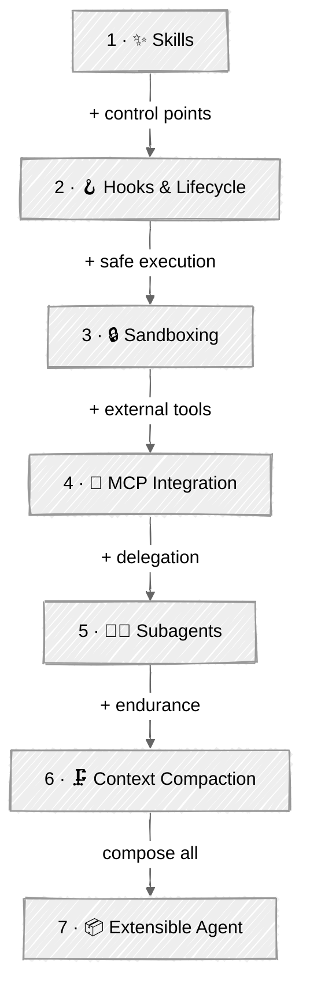

<!-- ---
title: "Loop Engineering"
description: "Harness the agent loop — add skills, hooks, sandboxing, MCP, subagents, and compaction one control surface at a time"
--- -->

# Loop Engineering

You built the bare agent loop in [Foundations](../01-foundations/05-agent-loop/). This module takes that loop and progressively *harnesses* it — each tutorial adds one orthogonal control surface that turns a naive loop into a real, extensible agent. These are the primitives behind Claude Code, Codex, and Copilot, built from scratch so you understand what the harness is doing before any framework hides it.

## 🗺️ Progression Path

| Step | Tutorial | What It Adds |
|:----:|----------|-------------|
| 1 | [Skills](01-skills/) | Load specialized capabilities on demand via filesystem SKILL.md files |
| 2 | [Hooks & Lifecycle](02-hooks-lifecycle/) | + pre/post tool-use and stop interception points |
| 3 | [Sandboxing](03-sandboxing/) | + isolated, resource-limited execution of agent code |
| 4 | [MCP Integration](04-mcp/) | + tools discovered from Model Context Protocol servers |
| 5 | [Subagents & Delegation](05-subagents/) | + child loops with isolated context returning summaries |
| 6 | [Context Compaction](06-context-compaction/) | + self-summarizing history for long-running loops |
| 7 | [Extensible Agent](07-extensible-agent/) 🏆 | Composes hooks + sandbox + MCP + subagents + compaction |

## 💡 Tips for Success

1. **Build on the loop, don't replace it.** Every tutorial reuses the Foundations agent loop — the harness is what changes, not the core.
2. **Each layer is orthogonal.** Skills, hooks, sandbox, MCP, subagents, and compaction are independent. Understand one at a time, then see them compose in the capstone.
3. **Run the dangerous examples.** Watch a hook deny `rm -rf`, watch the guardrail block a network call in the sandbox. The failure paths are the point.
4. **Mind the cost.** Subagents and compaction spend extra tokens. The scripts print counts and token usage — read them.

## 📚 Tutorials

### [01 - Skills](01-skills/)

Inject specialized capabilities on demand with filesystem Agent Skills. A cheap catalog (name + description) stays in the system prompt; full instructions and bundled assets load only when a task calls for them — three-tier progressive disclosure, plus path-traversal guarding. **Evolution:** the loop gains capabilities without bloating the base prompt.

---

### [02 - Hooks & Lifecycle](02-hooks-lifecycle/)

A hook registry fires callbacks at `pre_tool_use`, `post_tool_use`, and `stop`. Pre-tool hooks return allow/deny/rewrite decisions, so guardrails and logging become pluggable instead of inlined. **Evolution:** adds the extensibility seam every later tutorial plugs into.

---

### [03 - Sandboxing](03-sandboxing/)

Run agent-generated Python in isolation: a portable subprocess tier with `resource.setrlimit`, stripped environment, and timeouts, plus a Docker tier (`--network none`, capped memory) chosen automatically. Honest about what each tier protects against. **Evolution:** makes code execution safe, not just denylisted.

---

### [04 - MCP Integration](04-mcp/)

Discover tools from a Model Context Protocol server at runtime and publish your own with FastMCP. Bridge MCP schemas into both Anthropic and OpenAI tool loops. **Evolution:** tools come from a standard protocol instead of being hand-coded.

---

### [05 - Subagents & Delegation](05-subagents/)

A parent orchestrator delegates subtasks to fresh subagents with isolated context that return only a summary — with a fan-out cap and depth-1 workers. **Evolution:** scales the loop by pushing detail out of the parent's context.

---

### [06 - Context Compaction](06-context-compaction/)

Long-running loops summarize their own history past a token budget, pinning the task and never splitting a `tool_use` from its `tool_result`. **Evolution:** keeps a single thread alive when you can't delegate the context away.

---

### [07 - Extensible Agent](07-extensible-agent/) 🏆

**Capstone.** One agent wiring all five primitives — hooks, sandbox, MCP, subagents, and compaction — with each layer independent and swappable. **Evolution:** composition, not new capability.

---

## 🔗 Resources

- [Agent Skills (Anthropic)](https://www.anthropic.com/news/skills)
- [Model Context Protocol](https://modelcontextprotocol.io/)
- [MCP Python SDK](https://github.com/modelcontextprotocol/python-sdk)
- [MCP Specification](https://modelcontextprotocol.io/specification/2025-11-25)
- [Building Effective Agents (Anthropic)](https://www.anthropic.com/engineering/building-effective-agents)
- [OpenAI Responses API](https://platform.openai.com/docs/api-reference/responses)
- [gVisor — sandboxed container runtime](https://gvisor.dev/)
