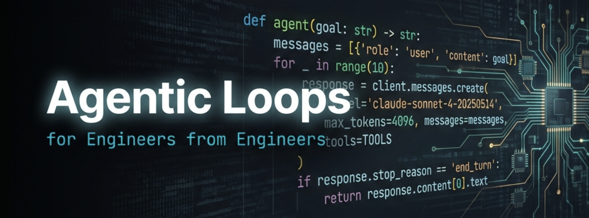

<div align="center">

<!--  -->

<!-- Keep these links. Translations will automatically update with the README. -->
[English](https://zdoc.app/en/agenticloops-ai/agentic-ai-engineering) |
[Deutsch](https://zdoc.app/de/agenticloops-ai/agentic-ai-engineering) |
[Español](https://zdoc.app/es/agenticloops-ai/agentic-ai-engineering) |
[français](https://zdoc.app/fr/agenticloops-ai/agentic-ai-engineering) |
[日本語](https://zdoc.app/ja/agenticloops-ai/agentic-ai-engineering) |
[한국어](https://zdoc.app/ko/agenticloops-ai/agentic-ai-engineering) |
[Português](https://zdoc.app/pt/agenticloops-ai/agentic-ai-engineering) |
[中文](https://zdoc.app/zh/agenticloops-ai/agentic-ai-engineering)

[](https://agenticloops.ai)
[](https://agenticloopsai.substack.com)
[](https://www.linkedin.com/company/agenticloops-ai)
[](https://x.com/agenticloops_ai)

</div>

# Agentic AI Engineering
**Stop reading about agents. Start building them.**

This is the repo for engineers who want to understand what's behind popular agents like **Claude Code**, **Codex**, and **GitHub Copilot** and how to build one by yourself. From your first LLM call to a production eval harness.

> Building AI agents is engineering, not magic. Master the constraints, not the hype.

## ❓ Why you need to learn this?

▶️ [Fundamental skills and knowledge you must have in 2026 for SWE](https://www.youtube.com/clip/UgkxNl2grro6BiM_x9bGSH_xMOSl32fxvthr)

> _How many of you actually can pull out a whiteboard and build me an agent? Can you show me the inferencing loop?_
>
> **_If you don't know this, your career is in jeopardy._**
>
> _What is a tool call? If you don't know what that is, you need to learn what it is and all these basic fundamentals. I preference candidates if they know what a tool call is, how the inferencing loop works, pull out a whiteboard — the same way we used to say, show me a linked list, reverse me this data structure._
>
> _**This is now baseline knowledge** because we're getting candidates in that can answer this stuff._
>
> — **Geoffrey Huntley**, creator of [Ralph Wiggum](https://ghuntley.com/ralph/)

Agent fluency is the new data-structures interview. We teach it **from first principles** - you build the loop, the tool calls, the memory, and the evals yourself before we ever introduce a framework. No magic. No black boxes. Just the primitives, in the order they were invented.

> 💡 None of this requires fancy frameworks. Just an LLM API, some tools, and a loop.
> **Build one this weekend. You'll understand agents better than reading 100 blog posts.**

## 🎯 Who is this for?

- **Engineers** who want to move beyond chat wrappers — understand how AI agents actually work **under the hood**, then build tool-using, autonomous ones from scratch
- **Anyone** who prefers **learning by running real code** over watching videos or reading theory

No prior AI/ML experience required - just Python basics and **curiosity** about building LLM-powered agents.

## 🧭 Why this repo?

- **We take production agents apart.** The [_Disassembling AI Agents_](https://agenticloopsai.substack.com) Substack series reverse-engineers Claude Code, GitHub Copilot, and OpenCode. You read how real agents work, then rebuild the pieces here.
- **First principles, no black boxes.** You build the agent loop, the tool executor, the memory layer, the eval harness from scratch — _before_ we introduce a single framework. Learn what each abstraction is hiding before you let one hide it for you.
- **Runnable in one command.** `uv run --directory <tutorial> python <script>.py`. No conda dance. No Jupyter kernel hunt.

## ⚡ 60-second quickstart

```bash
brew install uv   # or: pipx install uv
git clone https://github.com/agenticloops-ai/agentic-ai-engineering.git
cd agentic-ai-engineering
cp .env.example .env   # add your Anthropic and/or OpenAI keys

uv run --directory 01-foundations/01-simple-llm-call python 01_llm_call_anthropic.py
```

That's it. Every tutorial is self-contained and idempotent — you can jump in anywhere. Full setup details in [SETUP.md](SETUP.md). Or [open in Codespaces](https://codespaces.new/agenticloops-ai/agentic-ai-engineering) and skip local setup entirely.

> If you find this useful, a ⭐️ star helps us know we're on the right track. Join the [💬 discussion](https://github.com/agenticloops-ai/agentic-ai-engineering/discussions) or report an [🐛 issue](https://github.com/agenticloops-ai/agentic-ai-engineering/issues) — your input directly shapes what we build next.

---

## 📚 Companion reading

The tutorials teach you to build. Our [Substack](https://agenticloopsai.substack.com) gives you the mental model first - a foundational primer on how agents actually work, followed by teardowns of real production agents you use every day. **Read the post. Open the tutorial. Rebuild the pattern.**

[**How Agents Work: The Patterns Behind the Magic**](https://agenticloopsai.substack.com/p/how-agents-work-the-patterns-behind) - the core agentic loop from first principles. The four pattern levels (one-shot → single-tool → ReAct → planning), the role of the system prompt as behavioral design, and Ralph Mode as the outer loop. If you read one thing before opening the repo, read this. Pairs with → `01-foundations`.


## 🗂️ Tutorials Structure

The tutorials are organized into **modules** (`01-foundations`, `02-effective-agents`) that progress from basics to advanced concepts. Each module contains numbered **tutorials** that build on previous lessons. Inside each tutorial folder, you'll find:

- **Python scripts**  - Self-contained, runnable examples demonstrating key concepts
- **README.md** - Detailed explanations, code walkthroughs, and learning objectives

You can explore individual scripts independently or follow the complete learning path from start to finish. Each module ends with a  project that combines all concepts from the module into a single, production-style agent.

### 🎓 [01 - Foundations](01-foundations/README.md) 

Your first steps — from a single API call to a fully autonomous agent loop. Build everything from scratch to understand what's really happening under the hood.

1. **[Simple LLM Call](01-foundations/01-simple-llm-call/)** — First API call with token tracking
2. **[Prompt Engineering](01-foundations/02-prompt-engineering/)** — Guide model behavior
3. **[Chat](01-foundations/03-chat/)** — Interactive chat with message history
4. **[Tool Use](01-foundations/04-tool-use/)** — Enable function calling
5. **[Agent Loop](01-foundations/05-agent-loop/)** — Autonomous tool-using agents
6. **[Codebase Navigator](01-foundations/06-codebase-navigator/)**  — The Augmented LLM with RAG, tools, and memory

### 🧩 [02 - Effective Agents Patterns](02-effective-agents/README.md) 

Architectural patterns that separate toy demos from real agents. Based on Anthropic's "[Building Effective Agents](https://www.anthropic.com/engineering/building-effective-agents)" — learn when to chain, route, parallelize, or delegate.

1. **[Prompt Chaining](02-effective-agents/01-prompt-chaining/)** — Sequential multi-step pipelines
2. **[Routing](02-effective-agents/02-routing/)** — Classify input, dispatch to specialized handlers
3. **[Parallelization](02-effective-agents/03-parallelization/)** — Fan-out/fan-in, parallel tool calls
4. **[Orchestrator-Workers](02-effective-agents/04-orchestrator-workers/)** — Dynamic task decomposition
5. **[Evaluator-Optimizer](02-effective-agents/05-evaluator-optimizer/)** — Self-critique, iterative refinement
6. **[Human in the Loop](02-effective-agents/06-human-in-the-loop/)** — Approval gates, escalation, feedback
7. **[Content Writer](02-effective-agents/07-content-writer/)**  — Full agent composing all agentic workflow patterns

### 🧬 [03 - Advanced Techniques](03-advanced-techniques/README.md) 

Practical engineering problems you'll hit the moment agents leave the prototype stage. Context, cost, memory, multimodality, safety — solved one tutorial at a time.

1. **[Structured Output](03-advanced-techniques/01-structured-output/)** — JSON mode, schemas, constrained generation
2. **[Streaming](03-advanced-techniques/02-streaming/)** — SSE, token-by-token output, streaming tool calls
3. **[Context Engineering](03-advanced-techniques/03-context-engineering/)** — Window strategies, summarization, tool context
4. **[Cost Optimization](03-advanced-techniques/04-cost-optimization/)** — Prompt caching, model routing
5. **[Memory](03-advanced-techniques/05-memory/)** — Short-term, long-term, memory inspection
6. **[RAG Techniques](03-advanced-techniques/06-rag-techniques/)** — Hybrid search, agentic retrieval
7. **[Multimodal](03-advanced-techniques/07-multimodal/)** — Vision, image generation, audio
8. **[Guardrails](03-advanced-techniques/08-guardrails/)** — Input/output filtering, safety patterns

### 🧪 [04 - Testing & Evaluation](04-testing-evaluation/README.md) 

Agents are non-deterministic — testing them requires different thinking. Measure quality, catch regressions, and build confidence before shipping.

1. **[Unit Testing Agents](04-testing-evaluation/01-unit-testing-agents/)** — Mocking LLMs, deterministic tests
2. **[Evals](04-testing-evaluation/02-evals/)** — Accuracy, quality, regression benchmarks
3. **[Tracing & Debugging](04-testing-evaluation/03-tracing-debugging/)** — Observability during development
4. **[Red Teaming & Safety](04-testing-evaluation/04-red-teaming-safety/)** — Adversarial testing, guardrails
5. **[Benchmarking](04-testing-evaluation/05-benchmarking/)** — Comparing models, prompts, architectures head-to-head
6. **[Eval Frameworks](04-testing-evaluation/06-eval-frameworks/)** — Promptfoo, Braintrust, Langfuse integration
7. **[Eval Harness](04-testing-evaluation/07-eval-harness/)**  — Complete eval pipeline combining all techniques

### 🏗️ [05 - Frameworks](05-frameworks/README.md) 

One agent, nine implementations. Build the same system with each framework and compare trade-offs with your own hands.

1. **[No Framework](05-frameworks/01-no-framework/)** — Raw SDK baseline
2. **[LangGraph](05-frameworks/02-langgraph/)** — Graph-based orchestration
3. **[Pydantic AI](05-frameworks/03-pydantic-ai/)** — Type-safe agents
4. **[Google ADK](05-frameworks/04-google-adk/)** — Google's Agent Development Kit
5. **[AWS Strands](05-frameworks/05-aws-strands/)** — AWS agent SDK
6. **[CrewAI](05-frameworks/06-crewai/)** — Role-based multi-agent collaboration
7. **[AutoGen](05-frameworks/07-autogen/)** — Multi-agent conversations
8. **[LlamaIndex](05-frameworks/08-llamaindex/)** — Data-centric agents
9. **[Semantic Kernel](05-frameworks/09-semantic-kernel/)** — Microsoft AI orchestration

### 🏭 [06 - Production](06-production/README.md) 

The gap between "works on my laptop" and "runs reliably at scale." Principles, deployment, monitoring, cost control, and security.

1. **[12-Factor Agents](06-production/01-twelve-factor-agents/)** — Principles for production-grade agents
2. **[Deployment Strategies](06-production/02-deployment-strategies/)** — Containers, serverless, scaling
3. **[Monitoring & Observability](06-production/03-monitoring-observability/)** — Metrics, logging, tracing in prod
4. **[Cost Optimization](06-production/04-cost-optimization/)** — Token budgets, caching, model routing
5. **[Security & Guardrails](06-production/05-security-guardrails/)** — Auth, sandboxing, injection defense
6. **[Error Handling & Resilience](06-production/06-error-handling-resilience/)** — Retries, fallbacks, graceful degradation


## 💜 Support Us

If you find this project useful, consider supporting us:

[](https://github.com/sponsors/agenticloops-ai)

## 💬 FAQ

**Module not found?** Run `uv sync` in the lesson directory.

**API errors or authentication failures?** You need API keys from [Anthropic](https://console.anthropic.com/), [OpenAI](https://platform.openai.com/), or both, depending on which examples you run. See [SETUP.md](SETUP.md) for details.


## ⚖️ License

This project is licensed under the MIT License - see the [LICENSE](LICENSE) file for details.
